---
## Front matter
lang: ru-RU
title: Лабораторная работа №1
subtitle: "Кибербезопасность предприятия"
author:
  - Абакумова Олеся
  - Герра Гарсия Максимиано Антонио
  - Канева Екатерина
  - Клюкин Михаил
  - Ланцова Яна
institute:
  - Российский университет дружбы народов, Москва, Россия
date: 24 сентября 2025

## i18n babel
babel-lang: russian
babel-otherlangs: english

## Formatting pdf
toc: false
toc-title: Содержание
slide_level: 2
aspectratio: 169
section-titles: true
theme: metropolis
header-includes:
 - \metroset{progressbar=frametitle,sectionpage=progressbar,numbering=fraction}
 - \usepackage{fontspec}
 - \usepackage{polyglossia}
 - \setmainlanguage{russian}
 - \setotherlanguage{english}
 - \newfontfamily\cyrillicfont{Arial}
 - \newfontfamily\cyrillicfontsf{Arial}
 - \newfontfamily\cyrillicfonttt{Arial}
 - \setmainfont{Arial}
 - \setsansfont{Arial}
 
---

# Информация

## Состав исследовательской команды

Студенты группы НФИбд-02-22:

  - Абакумова Олеся
  - Герра Гарсия Максимиано Антонио
  - Канева Екатерина
  - Клюкин Михаил
  - Ланцова Яна

:::::::::::::: {.columns align=center}
::: {.column width="70%"}

:::
::::::::::::::

## Цель работы

Устранить уязвимости информационных систем Компании.

# Выполнение лабораторной работы

## Первая уязвимость ET SCAN. 

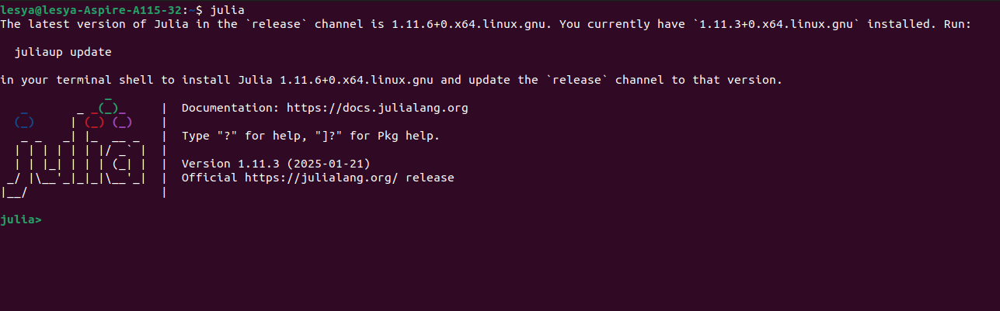{#fig:1 width=70%}

## Описание первой уязвимости. 

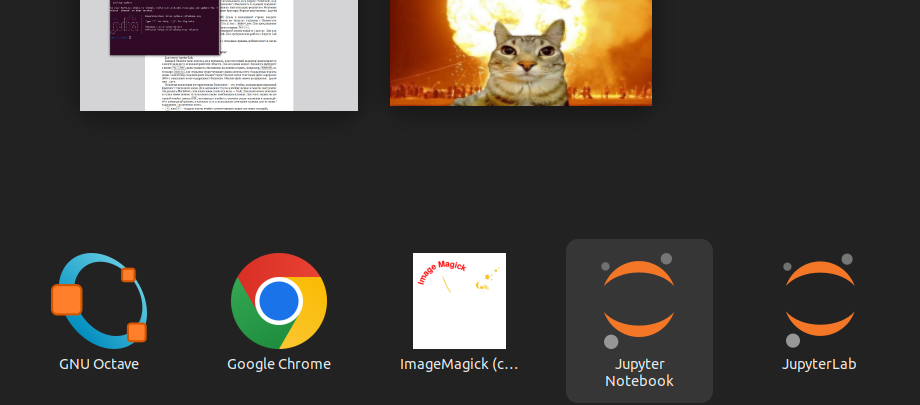{#fig:2 width=70%}

## Вторая уязвимость 

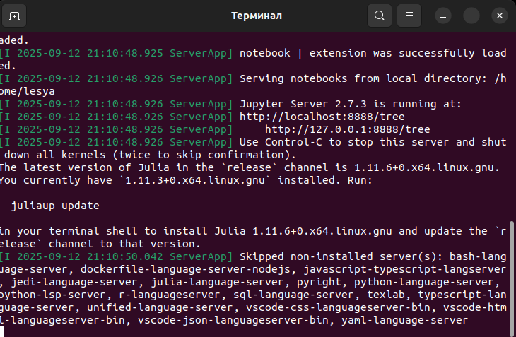{#fig:3 width=70%}

## Добавление инцидента 

{#fig:4 width=50%}

## Подключение к удалённому ПК

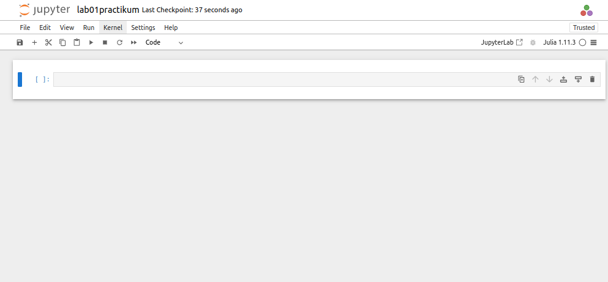{#fig:5 width=70%}

## Посещение веб-портала

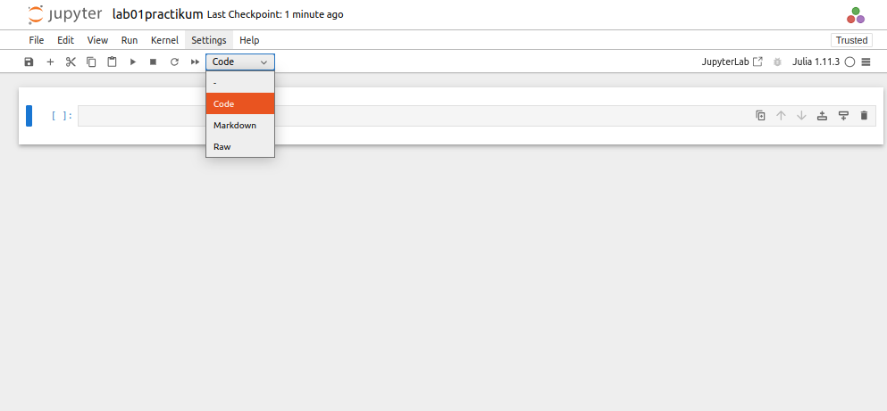{#fig:6 width=50%}

## Командная строка

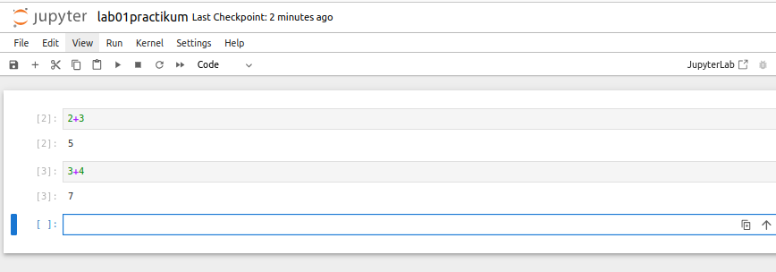{#fig:7 width=70%}

## Поиск уязвимости 

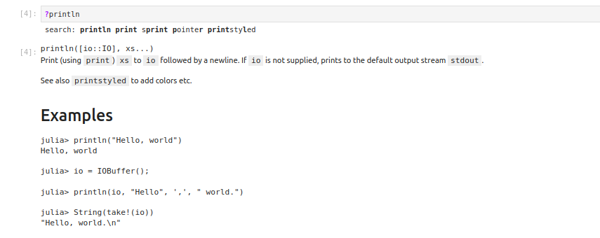{#fig:8 width=70%}

## Параметры уязвимой функции

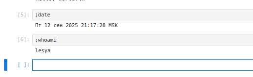{#fig:9 width=70%}

## Исправление уязвимости 

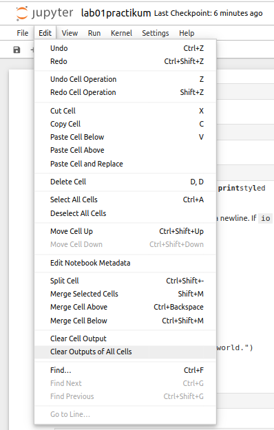{#fig:10 width=70%}

## Результат устранения инцидента

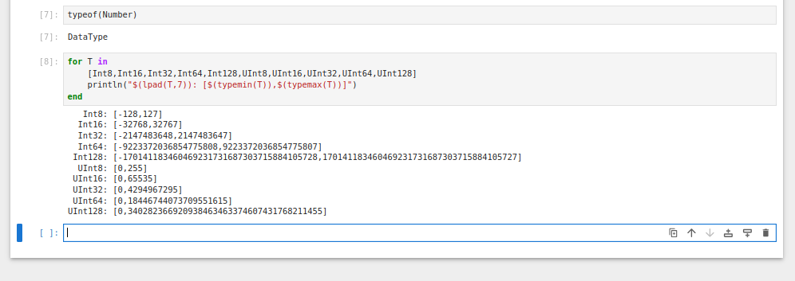{#fig:11 width=70%}

## Список установленных соединений 

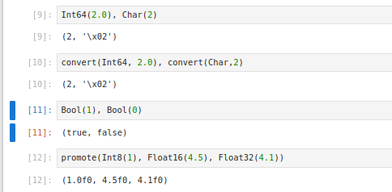{#fig:12 width=70%}

## Разрыв соединения с нарушителем 

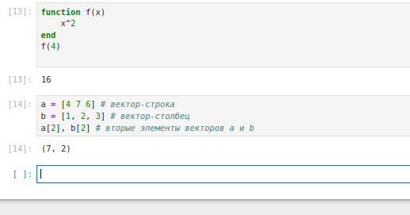{#fig:13 width=70%}

## Последствия первой уязвимости устранены 

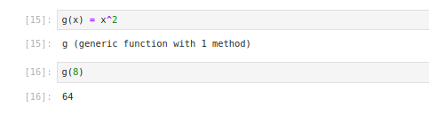{#fig:14 width=70%}

## Создание записи об инциденте 

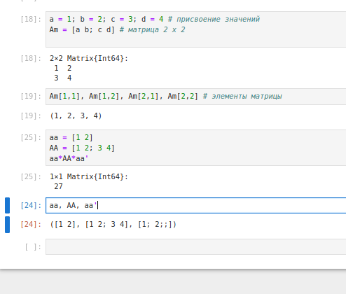{#fig:15 width=60%}

## Удаление записи DisableAntiSpyware в реестре 

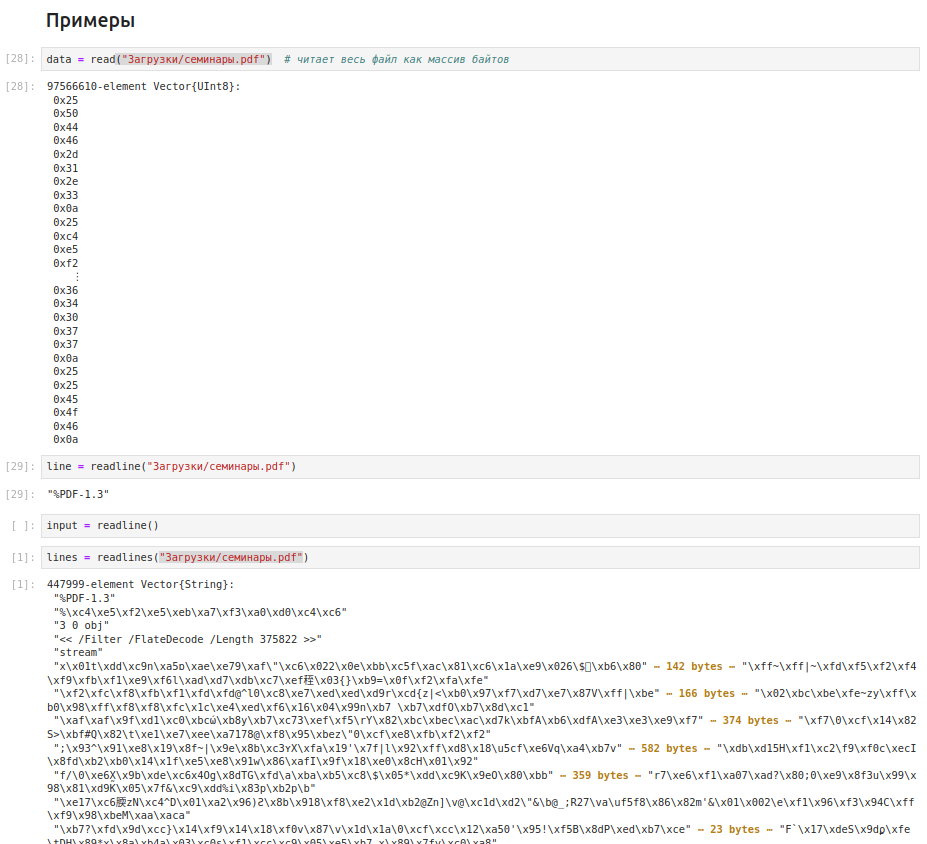{#fig:16 width=70%}

## Интерфейс Windows Defender 

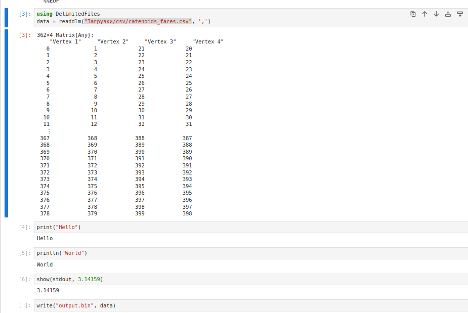{#fig:17 width=70%}

## Включение Real-time Protection 

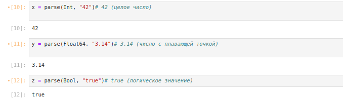{#fig:26 width=70%}

## Функционирование антивируса

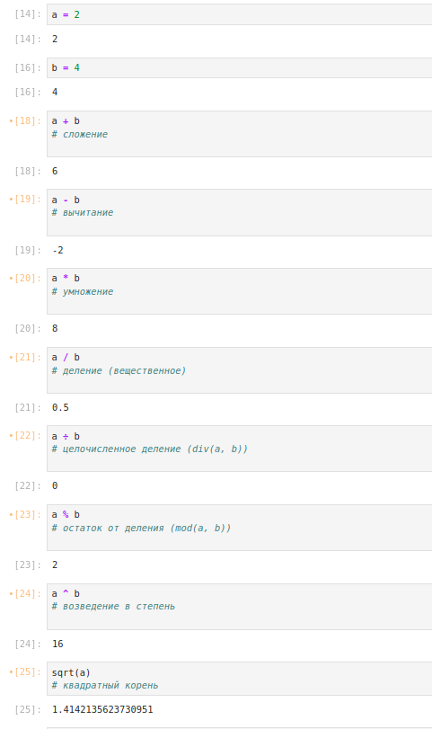{#fig:21 width=60%}

## Соединение с машиной нарушителя 

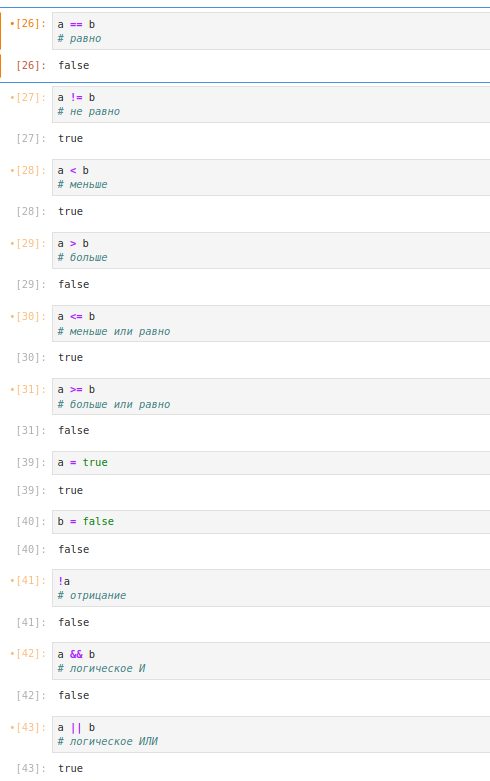{#fig:20 width=70%}

## Остановка процесса 

{#fig:21 width=70%}

## Логи подключений по RDP и успешная аутентификация 

{#fig:22 width=70%}

## Изменение пароля администратора 

{#fig:23 width=70%}

## Удаление привилегированного пользователя 

{#fig:24 width=60%}

## Все уязвимости устранены 

{#fig:25 width=70%}

# Выводы

Устранили уязвимости сайта Компании.
