---
## Front matter
title: "Отчёт по лабораторной работе №1"
subtitle: "Кибербезопасность предприятия"
author: |
  | Абакумова Олеся,
  | Герра Гарсия Максимиано Антонио, 
  | Канева Екатерина,
  | Клюкин Михаил, 
  | Ланцова Яна,
  | НФИбд-02-22

## Generic otions
lang: ru-RU
toc-title: "Содержание"

## Bibliography
bibliography: bib/cite.bib
csl: pandoc/csl/gost-r-7-0-5-2008-numeric.csl

## Pdf output format
toc: true # Table of contents
toc-depth: 2
lof: true # List of figures
lot: true # List of tables
fontsize: 12pt
linestretch: 1.5
papersize: a4
documentclass: scrreprt
## I18n polyglossia
polyglossia-lang:
  name: russian
  options:
	- spelling=modern
	- babelshorthands=true
polyglossia-otherlangs:
  name: english
## I18n babel
babel-lang: russian
babel-otherlangs: english
## Fonts
mainfont: IBM Plex Serif
romanfont: IBM Plex Serif
sansfont: IBM Plex Sans
monofont: IBM Plex Mono
mathfont: STIX Two Math
mainfontoptions: Ligatures=Common,Ligatures=TeX,Scale=0.94
romanfontoptions: Ligatures=Common,Ligatures=TeX,Scale=0.94
sansfontoptions: Ligatures=Common,Ligatures=TeX,Scale=MatchLowercase,Scale=0.94
monofontoptions: Scale=MatchLowercase,Scale=0.94,FakeStretch=0.9
mathfontoptions:
## Biblatex
biblatex: true
biblio-style: "gost-numeric"
biblatexoptions:
  - parentracker=true
  - backend=biber
  - hyperref=auto
  - language=auto
  - autolang=other*
  - citestyle=gost-numeric
## Pandoc-crossref LaTeX customization
figureTitle: "Рис."
tableTitle: "Таблица"
listingTitle: "Листинг"
lofTitle: "Список иллюстраций"
lotTitle: "Список таблиц"
lolTitle: "Листинги"
## Misc options
indent: true
header-includes:
  - \usepackage{indentfirst}
  - \usepackage{float} # keep figures where there are in the text
  - \floatplacement{figure}{H} # keep figures where there are in the text
---

# Цель работы

Устранить уязвимости и последствия информационных систем Компании.

# Выполнение лабораторной работы

## Уязвимость 1.SQL-инъекция.

Начнём выполнение лабораторной, сразу зайдём в список событий и найдём информацию о произошедшем (рис. [-@fig:1]):

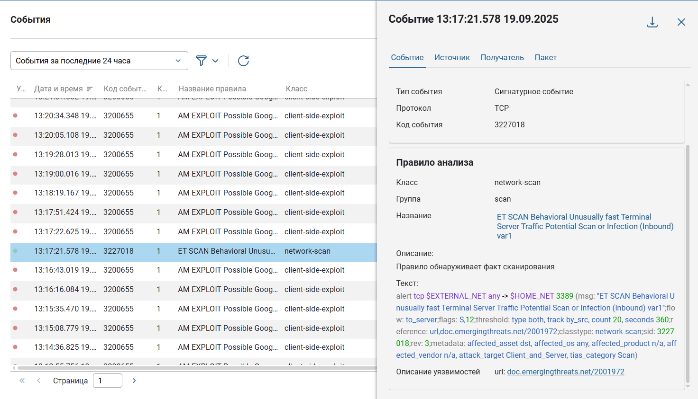{#fig:1 width=70%}

Посмотрели описание на CVE (рис. [-@fig:2]):

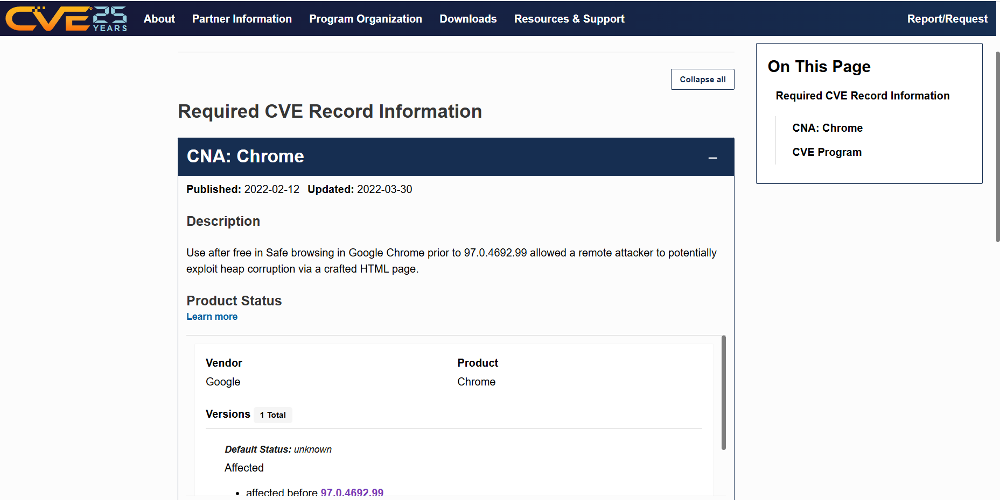{#fig:2 width=70%}

Делаем вывод. Нарушитель проводит сканирование сети 195.239.174. Пока его мотивы неясны.

Здесь мы можем наблюдать, что в сетевом трафике найден программный код(рис. [-@fig:3]):

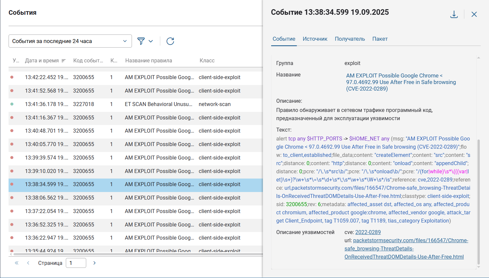{#fig:3 width=70%}

Найденные улики дают нам понять, что нарушитель сканирует веб-сервер на предмет SQL-инъекций утилитой sqlmap. Нарушитель генерирует php reverse shell, используя найденную SQL-инъекцию, загружает вредоносный файл на веб-сервер. Нарушитель генерирует письмо с вредоносным вложением и отправляет администратору.Администратор в свою же очередь открывает письмо и тогда запускает вредоносный скрипт. Об этом как раз таки свидетельствует наличие программного кода в сетевом трафике.Как итог, нарушитель получает контроль над компьютером администратора и meterpreter-сессию.

Изучили уязвимость, добавили инцидент (рис. [-@fig:4]):

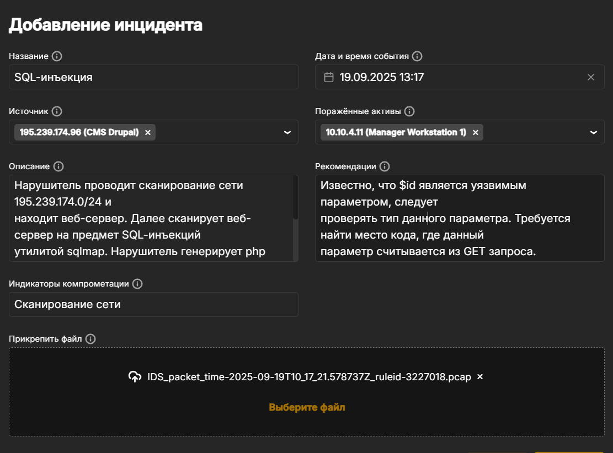{#fig:4 width=70%}

На узле Web Server PHP находится уязвимый веб-сервер на 80 порту. Нарушитель использует данную уязвимость для загрузки и для выполнения php reverse shell.
Для этого мы подключаемся к удаленному рабочему столу (рис. [-@fig:5]):

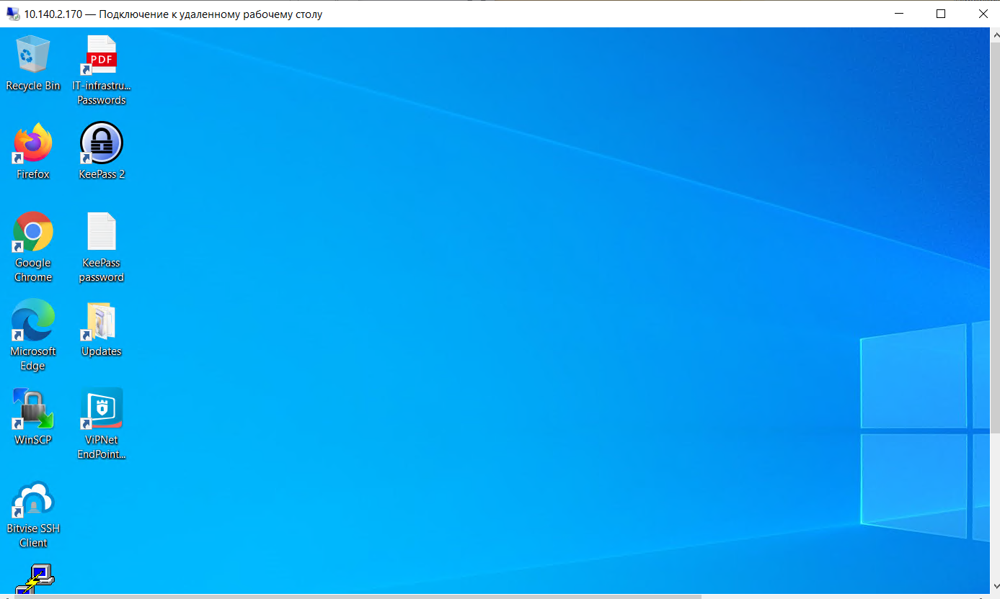{#fig:5 width=70%}

С удалённого ПК зашли на веб-портал (рис. [-@fig:6]):

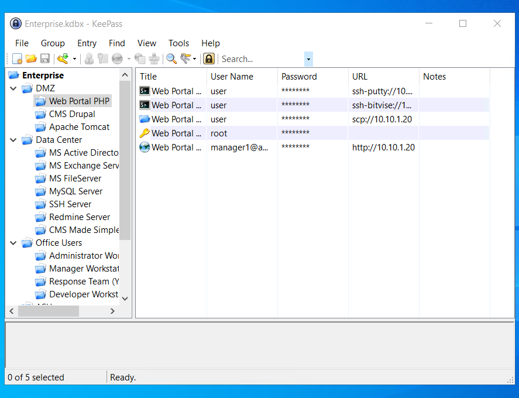{#fig:6 width=70%}

Далее для устранения уязвимости зашли в командную строку (рис. [-@fig:7]):

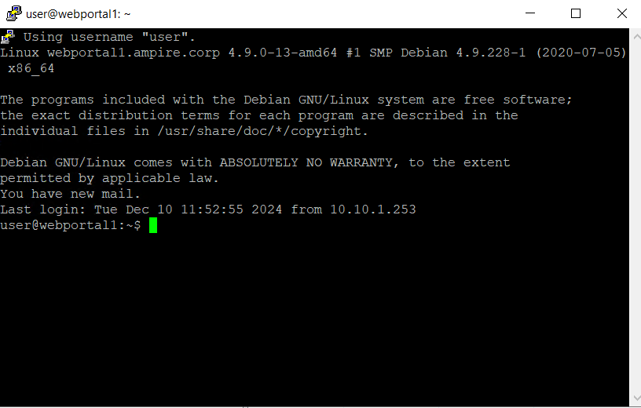{#fig:7 width=70%}

Известно, что 4id$ является уязвимым параметром, следует проверять тип данного параметра. Требуется найти место кода, где данный параметр считывается из GET запроса (рис. [-@fig:8]):

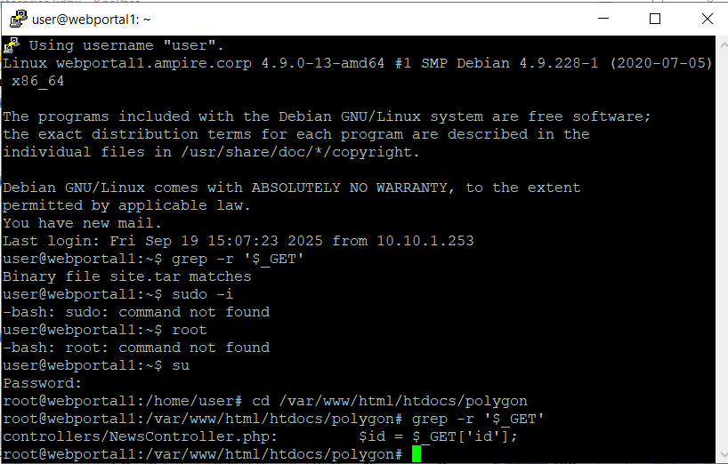{#fig:8 width=70%}

Нашли место с уязвимостью - она в функции actionView (рис. [-@fig:9]):

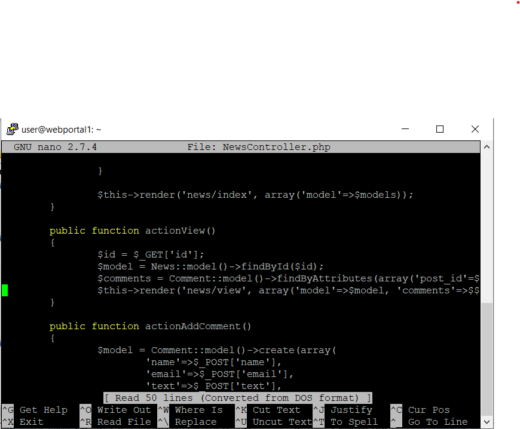{#fig:9 width=70%}

Устраним уязвимость, добавляя проверку типа параметра $id (рис. [-@fig:10]):

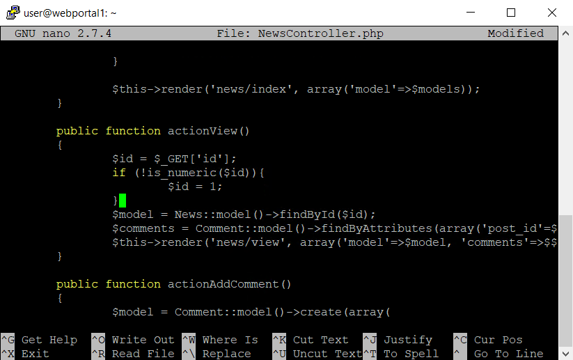{#fig:10 width=70%}

Проверили, что инцидент устранён (рис. [-@fig:11]), теперь будем устранять последствие:

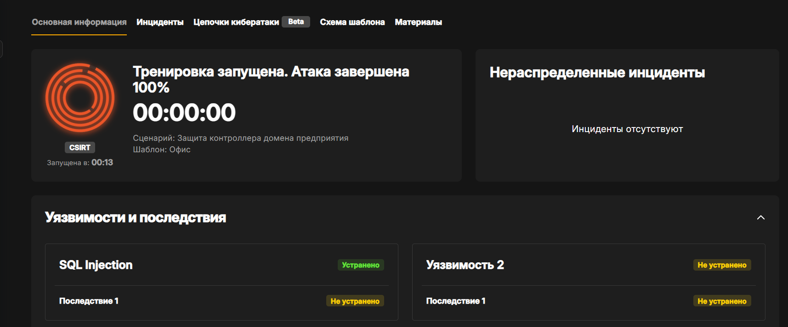{#fig:11 width=70%}

## Последствие уязвимости 1

Нарушитель устанавливает shell сессию с веб-порталом PHP. Для обнаружения последствия необходимо проверить сокеты уязвимой машины при помощи утилиты ss с ключами -tp (рис. [-@fig:12]):

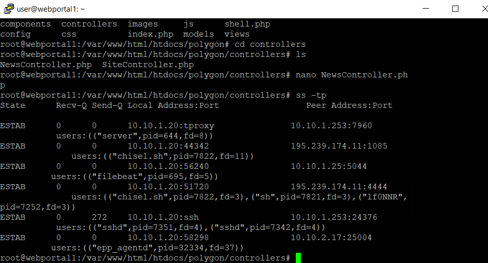{#fig:12 width=70%}

Завершаем сессию нарушителя с помощью команды ss и параметром -K (рис. [-@fig:13]):

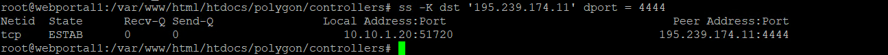{#fig:13 width=70%}

Таким образом, устранили последствия первой уязвимости и закрыли инцидент (рис. [-@fig:14]):

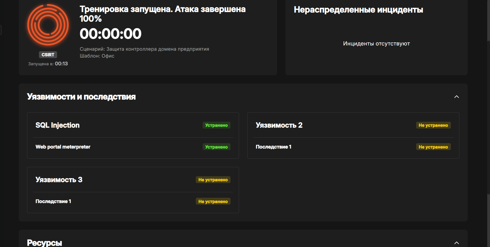{#fig:14 width=70%}

## Уязвимость 2. Отключенная защита антивируса.

На узле администратора выключена защита в реальном времени Windows Defender, что дает нарушителю возможность получить контроль над компьютером администратора при запуске им вредоносного скрипта diag.psl.

Создаём запись об инциденте (рис. [-@fig:15]):

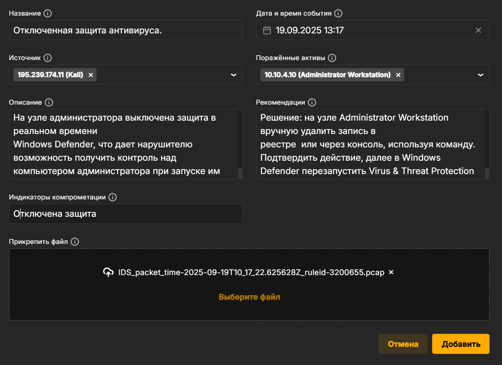{#fig:15 width=70%}

Далее, поскольку на узле Administrator Defender антивирус был отключен, вручную удаляем запись (рис. [-@fig:24]), подтверждаем действие, в Windows Defender перезапускаем Virus & Threat Protection (рис. [-@fig:25]), включаем Real-time Protection (рис. [-@fig:26]), проверяем, что всё работает (рис. [-@fig:21]):

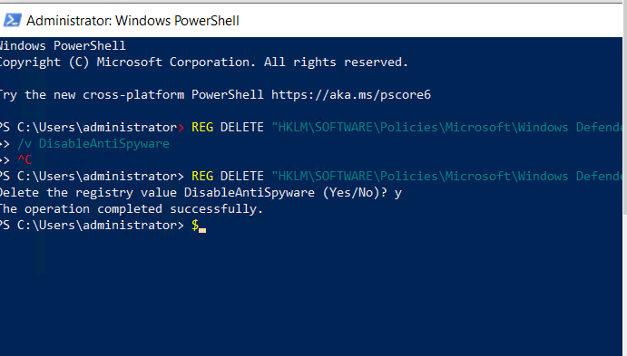{#fig:24 width=70%}

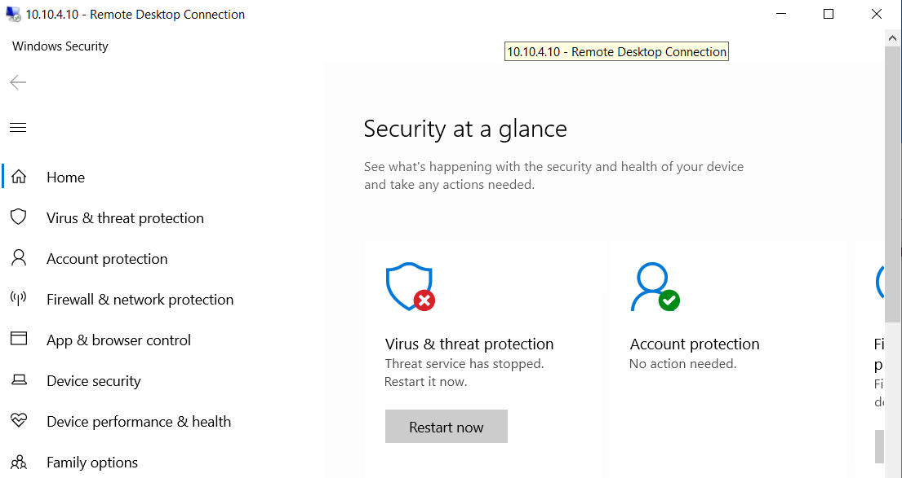{#fig:25 width=70%}

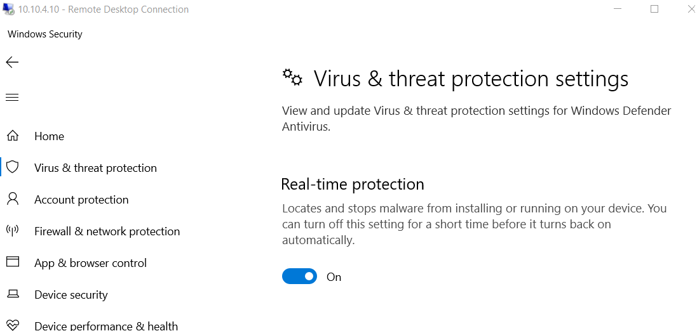{#fig:26 width=70%}

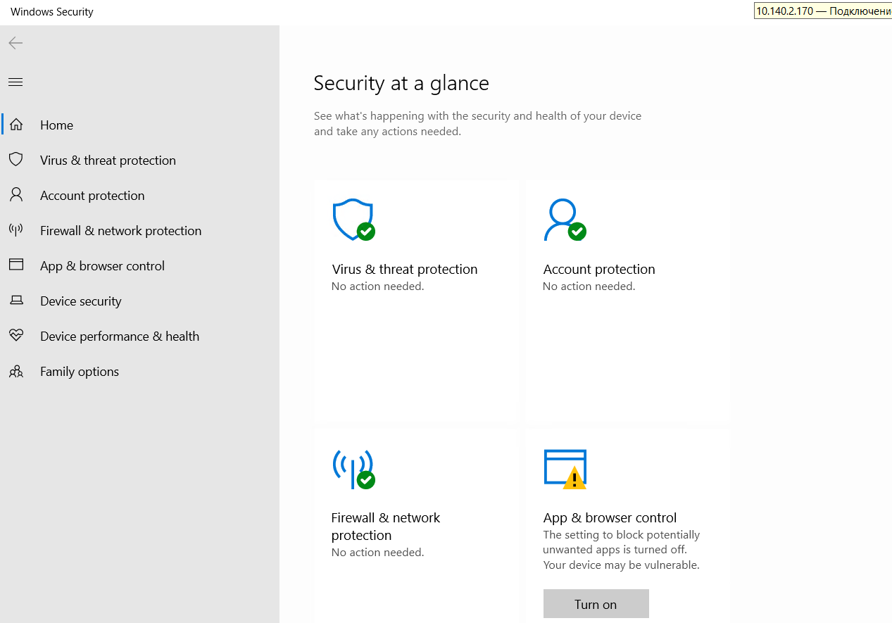{#fig:21 width=70%}

После выполненных действий необходимо перезагрузить Windows.

## Последствие уязвимости 2. Admin meterpreter.

Далее устраняем последствия. Проверяем, что сейчас соединение нарушителя есть (рис. [-@fig:28]):

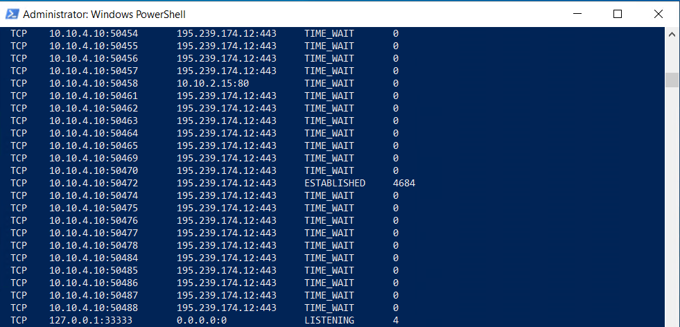{#fig:28 width=70%}

Разрываем соединение с помощью команды taskkill (рис. [-@fig:29]):

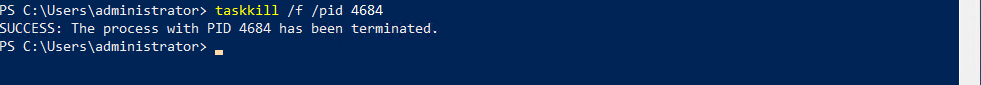{#fig:29 width=70%}

Далее устраняем проблему, связанную со слабым паролем. На узле MS Active Directory установлен слабый пароль к учётной записи администратора, что позволяет нарушителю подобрать пароль, смотрим логи подключений по RDP (рис. [-@fig:30]):

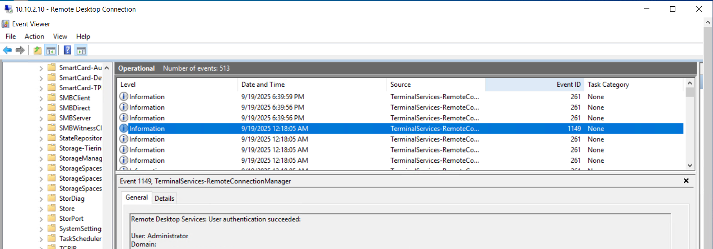{#fig:30 width=70%}

Устраним уязвимость, сменив пароль администратора (рис. [-@fig:31]):

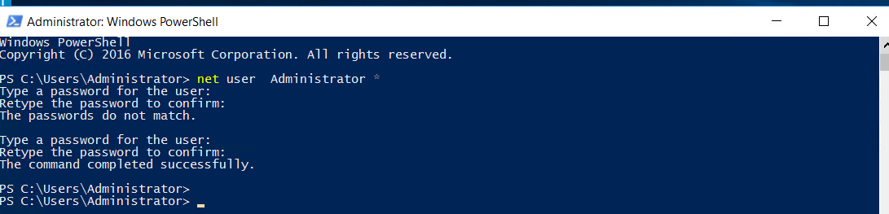{#fig:31 width=70%}

Переходим к устранению последствий. Был создан новый привелигированный пользователь, находим его в Administrative Tools - Active Directory Users and computers, во вкладке Users и удаляем (рис. [-@fig:32]):

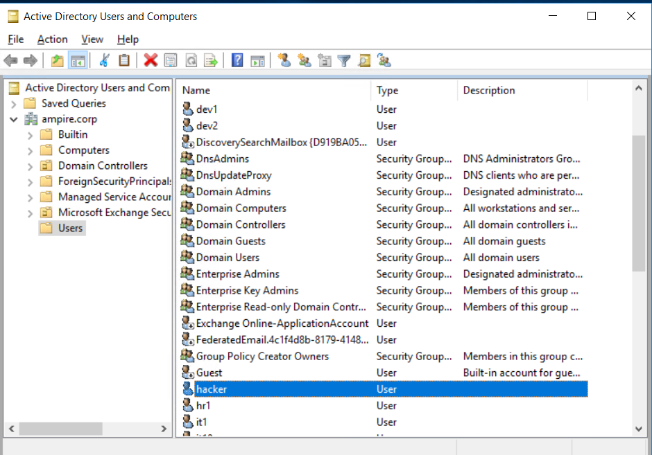{#fig:32 width=70%}

Проверяем, что все уязвимости и их последствия устранены (рис. [-@fig:33]):

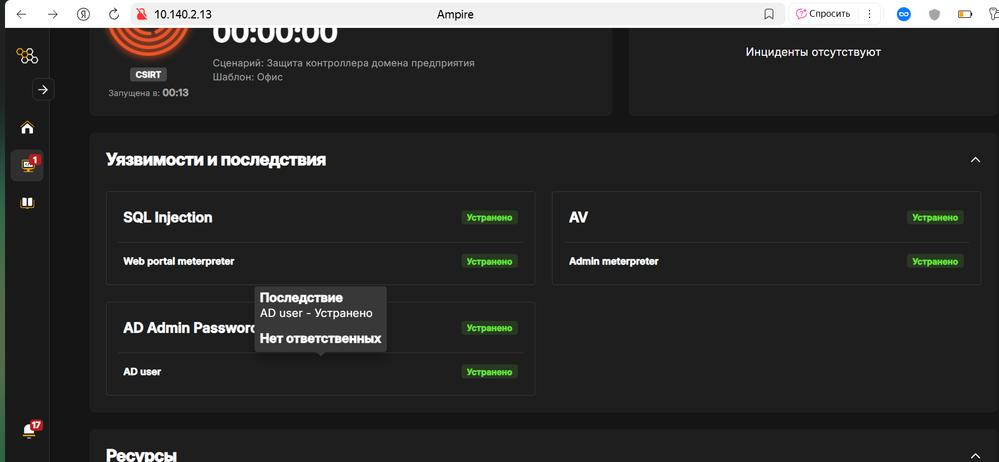{#fig:33 width=70%}

# Выводы

Устранили уязвимости сайта Компании.
