---
## Front matter
lang: ru-RU
title: Лабораторная работа №2
subtitle: "Кибербезопасность предприятия"
author:
  - Абакумова Олеся
  - Герра Гарсия Максимиано Антонио
  - Канева Екатерина
  - Клюкин Михаил
  - Ланцова Яна
institute:
  - Российский университет дружбы народов, Москва, Россия
date: 15 октября 2025

## i18n babel
babel-lang: russian
babel-otherlangs: english

## Formatting pdf
toc: false
toc-title: Содержание
slide_level: 2
aspectratio: 169
section-titles: true
theme: metropolis
header-includes:
 - \metroset{progressbar=frametitle,sectionpage=progressbar,numbering=fraction}
 - \usepackage{fontspec}
 - \usepackage{polyglossia}
 - \setmainlanguage{russian}
 - \setotherlanguage{english}
 - \newfontfamily\cyrillicfont{Arial}
 - \newfontfamily\cyrillicfontsf{Arial}
 - \newfontfamily\cyrillicfonttt{Arial}
 - \setmainfont{Arial}
 - \setsansfont{Arial}
 
---

# Информация

## Состав исследовательской команды

Студенты группы НФИбд-02-22:

  - Абакумова Олеся
  - Герра Гарсия Максимиано Антонио
  - Канева Екатерина
  - Клюкин Михаил
  - Ланцова Яна

:::::::::::::: {.columns align=center}
::: {.column width="70%"}

:::
::::::::::::::

## Цель работы

Устранить уязвимости и последствия для корпоративного мессенджера.

# Выполнение лабораторной работы

## Первая уязвимость CVE-2020-24186 

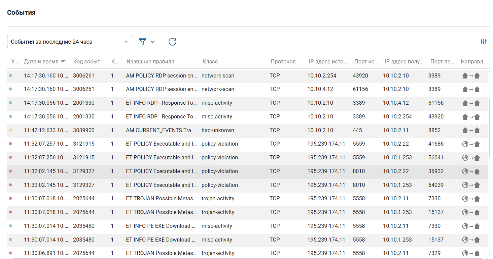{width=60%}

## Первая уязвимость CVE-2020-24186 

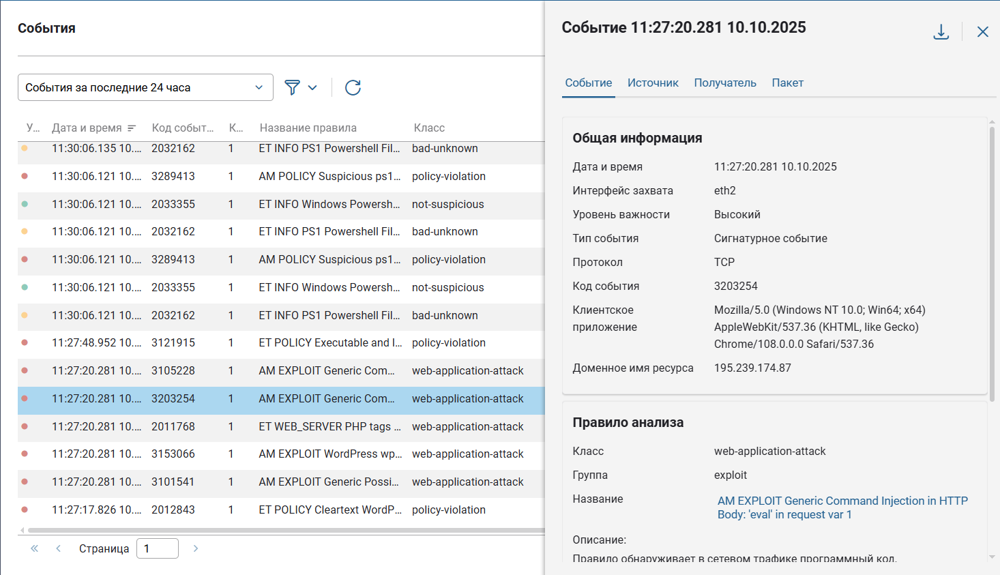{width=60%}

## Просмотр обзора события первой уязвимости 

{width=60%}

## Схема атаки 

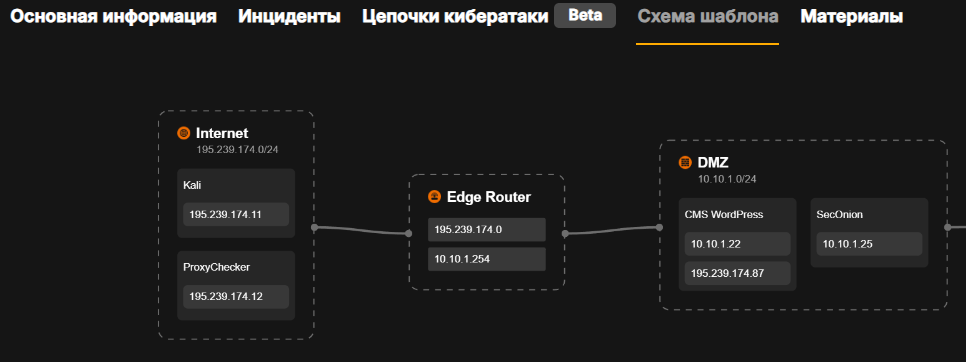{width=60%}

## Просмотр подозрительного запроса

{width=60%}

## Добавление инцидента по первой уязвимости

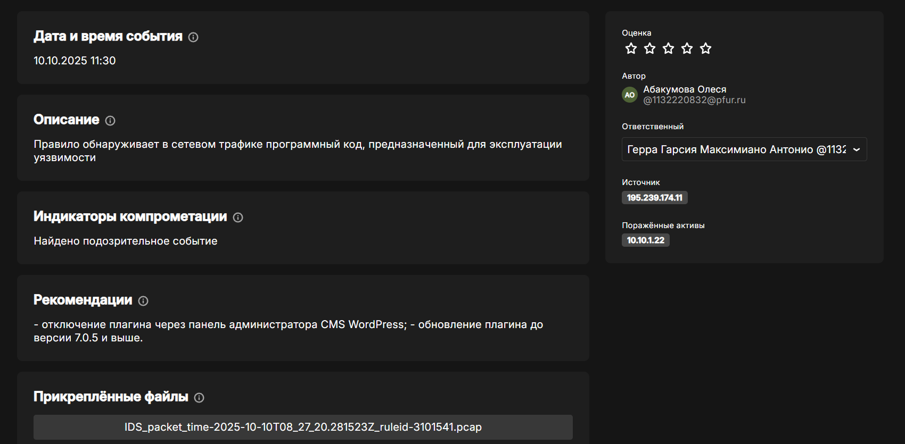{width=60%}

## Подключение к устройству

{width=60%}

## Вход веб-сайт 10.10.1.22

{width=60%}

## Страница плагинов на веб-сайте

{width=60%}

## Отключение плагина WpDiscuz

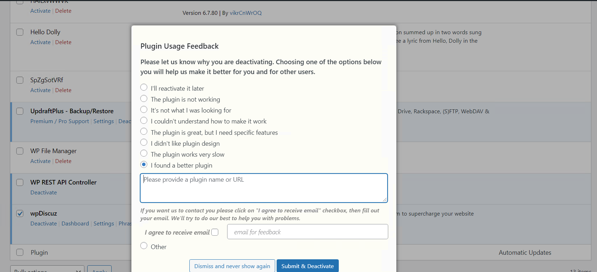{width=60%}

## Страница сайта компании

{width=60%}

## Список резервных копий

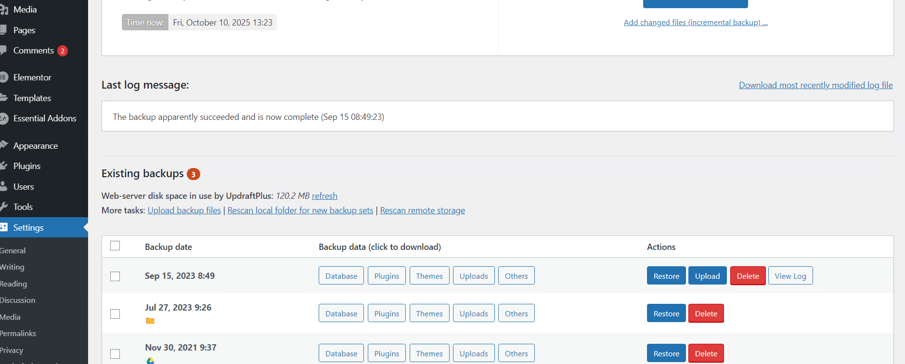{width=60%}

## Выбор компонентов переустановки

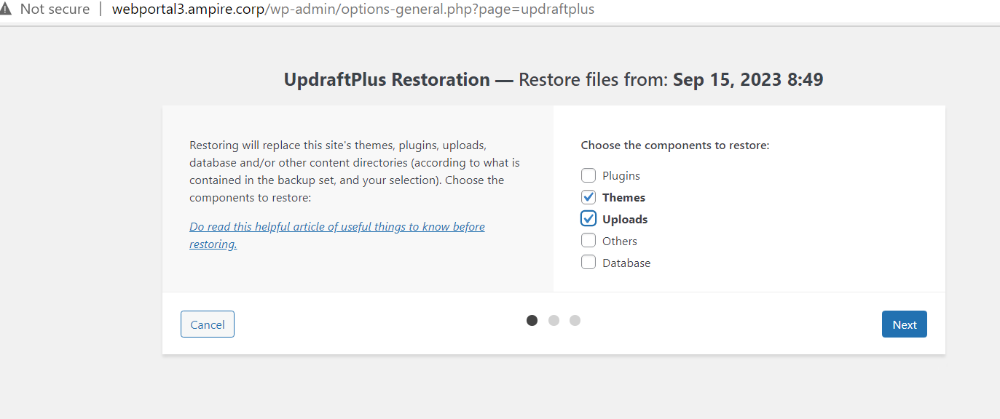{width=60%}

## Сообщение об удалении директорий

{width=60%}

## Успешное восстановление предыдущей версии

{width=60%}

## Отображение информации о TCP-соединениях и закрытие сессии

{width=60%}

## Первая уязвимость и её последствия устранены

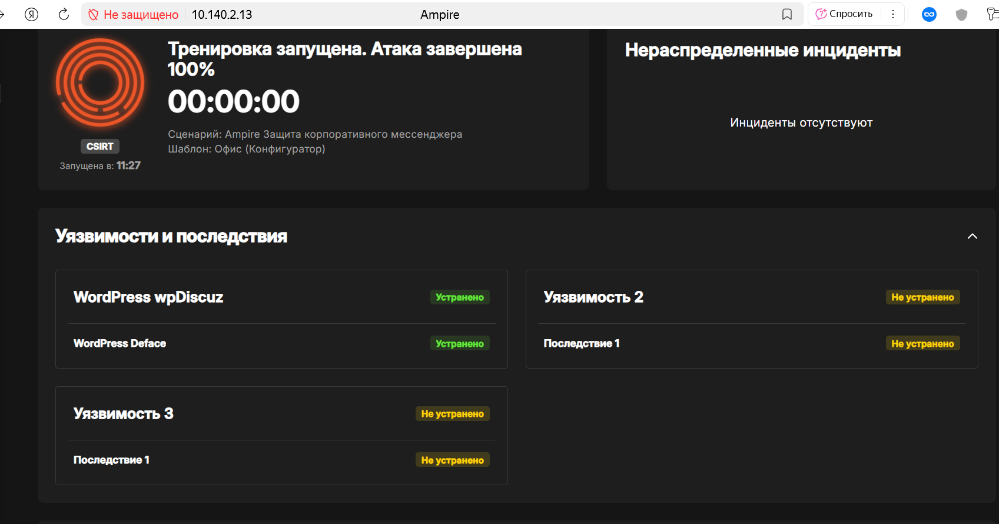{width=60%}

## Обнаружение подозрительного события

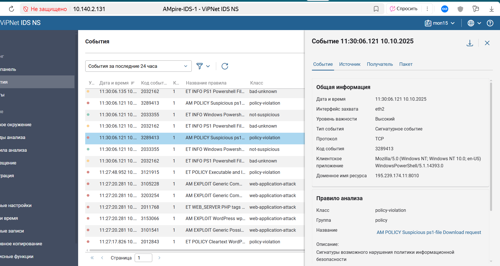{width=60%}

## Карточка второго инциндента

{width=60%}

## Окно `Internet Information Services (IIS) Manager`

{width=60%}

## «IP Address and Domain Restrictions»

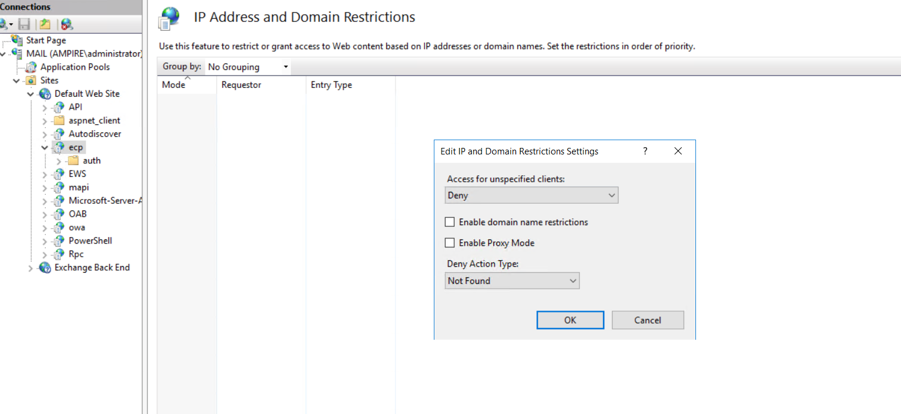{width=60%}

## Завершение процесса

{width=60%}

## Удаление файла web-оболочки

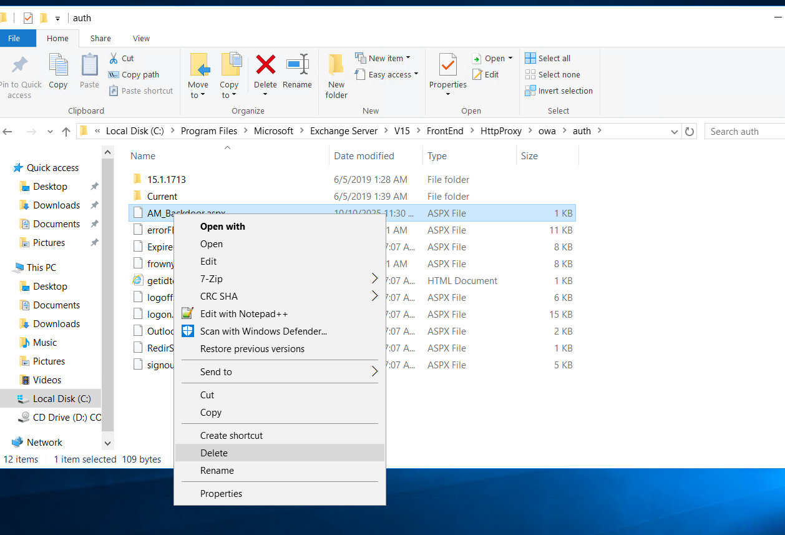{width=60%}

## События ИБ в сетевом сенсоре `ViPNet IDS NS`

{width=60%}

## Карточка инцидента третьей уязвимости

{width=60%}

## Сброс пароля

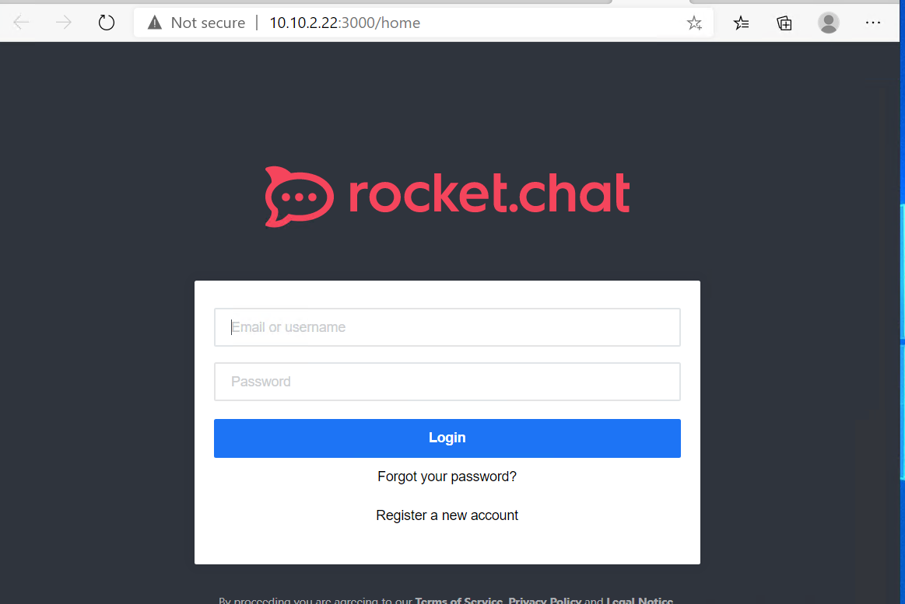{width=60%}

## Ссылка для сброса пароля

{width=60%}

## Создание нового пароля

{width=60%}

## Проверка наличия БД

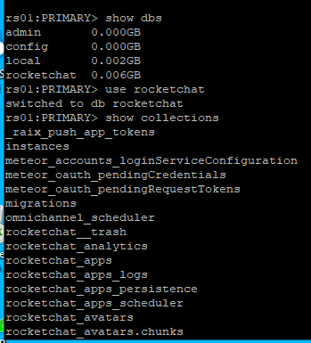{width=30%}

## Остановка службы и удаление БД

{width=40%}

## Восстановление БД из бэкапа

{width=60%}

## Запуск `RocketChat`

{width=40%}

## Редактирование конфигурации БД

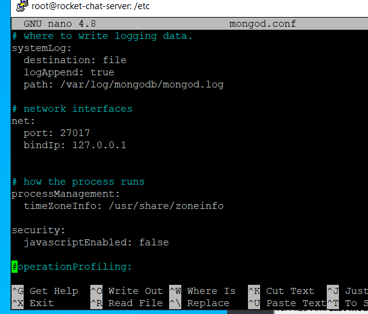{width=40%}

## Коды восстановления

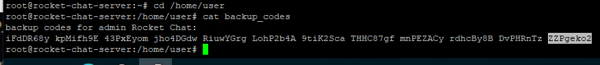{width=80%}

## Ввод кода

{width=40%}

## Успешный вход

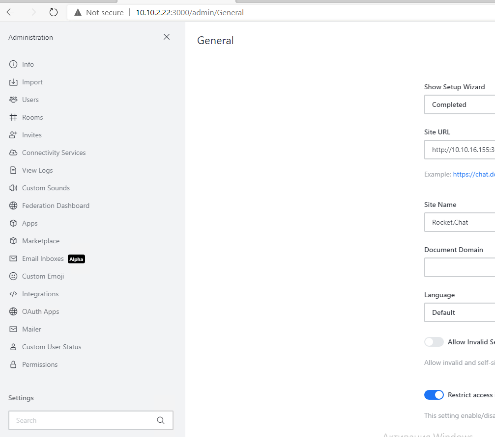{width=40%}

## Находим сессию с нарушителем с пометкой `testsystem`

{width=60%}

## Закрытие сессии с нарушителем

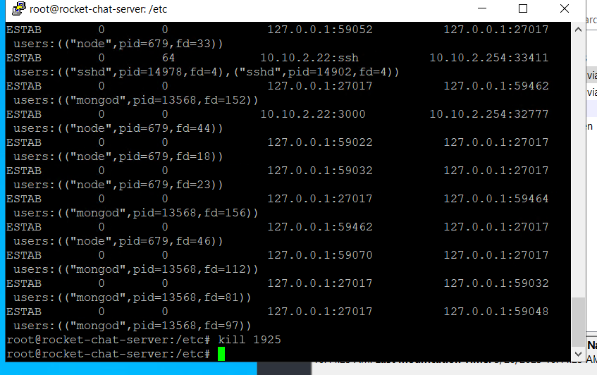{width=60%}

## Закрытые инциденты

{width=60%}

## Все уязвимости и последствия устранены

{width=60%}

# Выводы

Мы устранили уязвимости и последствия после атаки злоумышленника на сайт Компании с целью получения дсотупа к внутренним ресурсам.