---
## Front matter
title: "Отчёт по лабораторной работе №2"
subtitle: "Кибербезопасность предприятия"
author: |
  | Абакумова Олеся,
  | Герра Гарсия Максимиано Антонио, 
  | Канева Екатерина,
  | Клюкин Михаил, 
  | Ланцова Яна,
  | НФИбд-02-22

## Generic otions
lang: ru-RU
toc-title: "Содержание"

## Bibliography
bibliography: bib/cite.bib
csl: pandoc/csl/gost-r-7-0-5-2008-numeric.csl

## Pdf output format
toc: true # Table of contents
toc-depth: 2
lof: true # List of figures
lot: true # List of tables
fontsize: 12pt
linestretch: 1.5
papersize: a4
documentclass: scrreprt
## I18n polyglossia
polyglossia-lang:
  name: russian
  options:
	- spelling=modern
	- babelshorthands=true
polyglossia-otherlangs:
  name: english
## I18n babel
babel-lang: russian
babel-otherlangs: english
## Fonts
mainfont: IBM Plex Serif
romanfont: IBM Plex Serif
sansfont: IBM Plex Sans
monofont: IBM Plex Mono
mathfont: STIX Two Math
mainfontoptions: Ligatures=Common,Ligatures=TeX,Scale=0.94
romanfontoptions: Ligatures=Common,Ligatures=TeX,Scale=0.94
sansfontoptions: Ligatures=Common,Ligatures=TeX,Scale=MatchLowercase,Scale=0.94
monofontoptions: Scale=MatchLowercase,Scale=0.94,FakeStretch=0.9
mathfontoptions:
## Biblatex
biblatex: true
biblio-style: "gost-numeric"
biblatexoptions:
  - parentracker=true
  - backend=biber
  - hyperref=auto
  - language=auto
  - autolang=other*
  - citestyle=gost-numeric
## Pandoc-crossref LaTeX customization
figureTitle: "Рис."
tableTitle: "Таблица"
listingTitle: "Листинг"
lofTitle: "Список иллюстраций"
lotTitle: "Список таблиц"
lolTitle: "Листинги"
## Misc options
indent: true
header-includes:
  - \usepackage{indentfirst}
  - \usepackage{float} # keep figures where there are in the text
  - \floatplacement{figure}{H} # keep figures where there are in the text
---

# Цель работы

Устранить уязвимости и последствия для корпоративного мессенджера.

# Выполнение лабораторной работы

## Уязвимость 1. CVE-2020-24186.

Начнём выполнение лабораторной, зайдём в список событий и найдём информацию о произошедей атаке (рис. [-@fig:001]). B списках событий видно, что система безопасности обнаружила в сетевом трафике вредоносный программный код (EXPLOIT), предназначенный для эксплуатации уязвимости в системе (рис. [-@fig:002]).

{#fig:001 width=70%}

{#fig:002 width=70%}

Найденное событие фиксирует успешную попытку внедрения операционной команды на веб-сервер. Атакующий сумел передать на сервер в теле HTTP-запроса данные, которые содержали команду для выполнения на самой ОС сервера.

Посмотрим как нейтрализовать найденную уязвимость по СVE, чтобы получить точную информацию о характере уязвимости и ее критичности (рис. [-@fig:003]). 

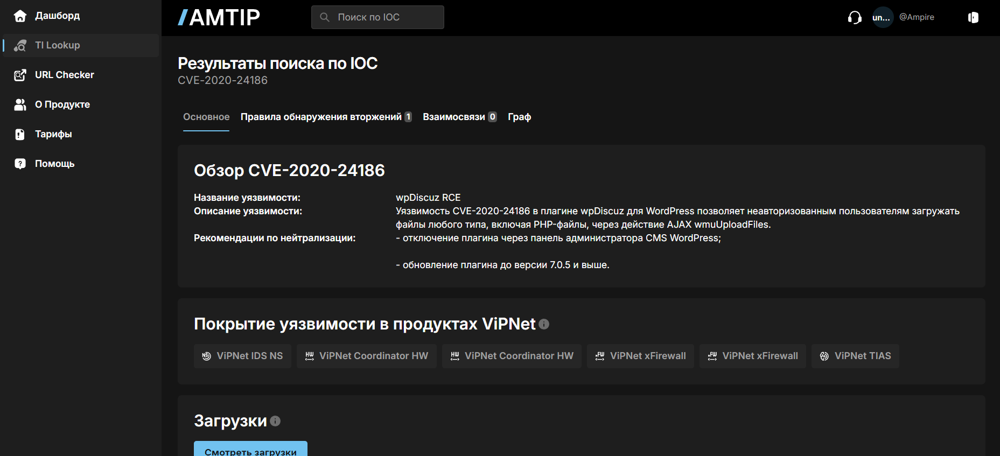{#fig:003 width=70%}

Посмотрим графическую схему корпоративной сети. Атакующий с рабочей станции Kali Linux проводит атаку на один из DMZ серверов компании (рис. [-@fig:004]).

{#fig:004 width=70%}

Проанализируем пакет с подозрительным HTTP-запросом через SecOnion, отфильтровав по уязвимому узлу (рис. [-@fig:005]).

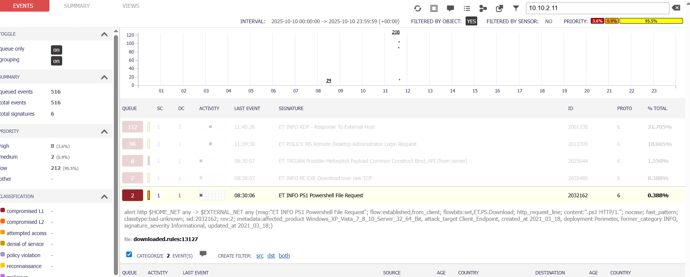{#fig:005 width=70%}

Изучили уязвимость, добавили инцидент (рис. [-@fig:006]).

{#fig:006 width=70%}

Для устранения уязвимости подключимся к атакованному устройству через удаленный рабочий администратора стол с помощью KeyPass (рис. [-@fig:007]).

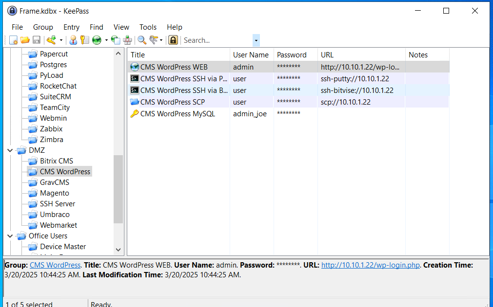{#fig:007 width=70%}

Залогинемся на веб-сайте под администратором (рис. [-@fig:008]).

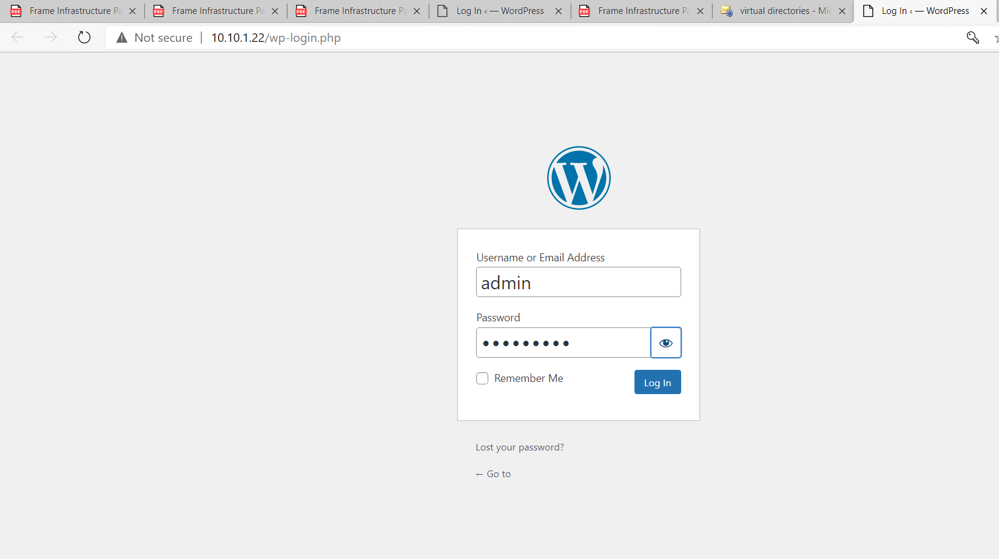{#fig:008 width=70%}

Перейдем в раздел плагинов на сайте и найдем требующийся (рис. [-@fig:009]). 

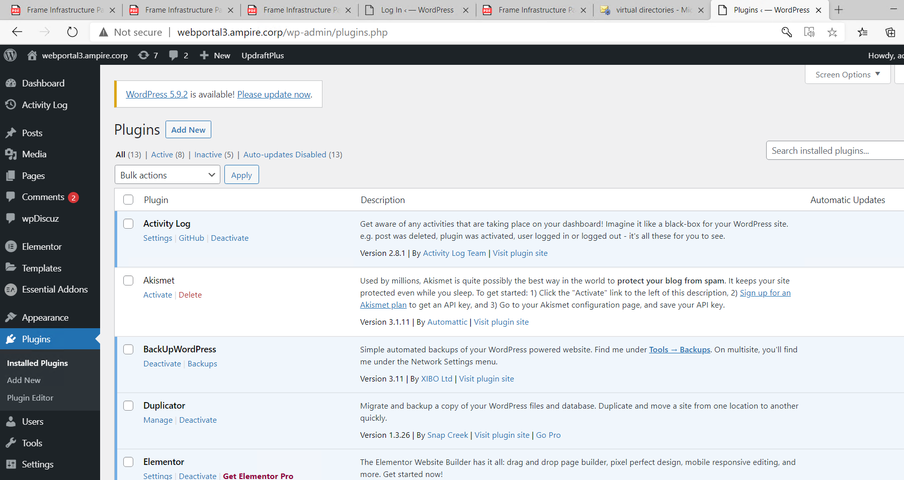{#fig:009 width=70%}

Для устранения уязвимости, необходимо было или деактивировать плагин WpDiscuz, который был точкой входа для атакующего. Данная уязвимость исправлена разработчиками в версии 7.0.5 и выше. Для закрытия уязвимости достаточно обновить версию плагина WpDiscuz на более актуальную, однако у нас отсутвует подключение к интернету. Поэтому отключим данный плагин по выбранной причине (рис. [-@fig:010]).

{#fig:010 width=70%}

Открыв страницу сайта компании `http://webportal3.ampire.corp` увидим изменения (рис. [-@fig:011]):

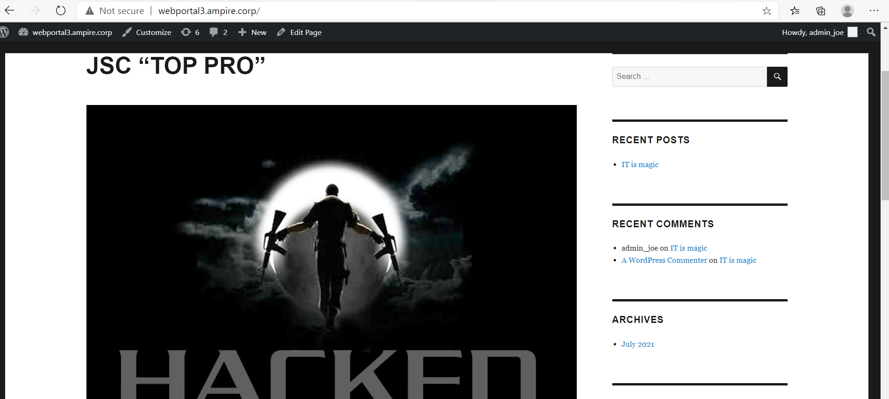{#fig:011 width=70%}

Чтобы устанить уязвимость необходимо выполнить восстановление из последнего файла резервной копии, поскольку на веб-сервере работает FTP-сервер vsftpd, который дает возможность плагину Updraft Backup/Restore сохранять и скачивать резервную копию.

Посмотрим последние резервные копии на сайте (рис. [-@fig:012]).

{#fig:012 width=70%}

Активируем версию от 15 сентября 2023 года и попытаемся восстановить данные. В качестве компонентов для переустановки укажем Themes и Uploads (рис. [-@fig:013]).

{#fig:013 width=70%}

Поскольку возникла ошибка восстановления, нужно нажать опцию Delete Old Directories в журнале действий (рис. [-@fig:014]):

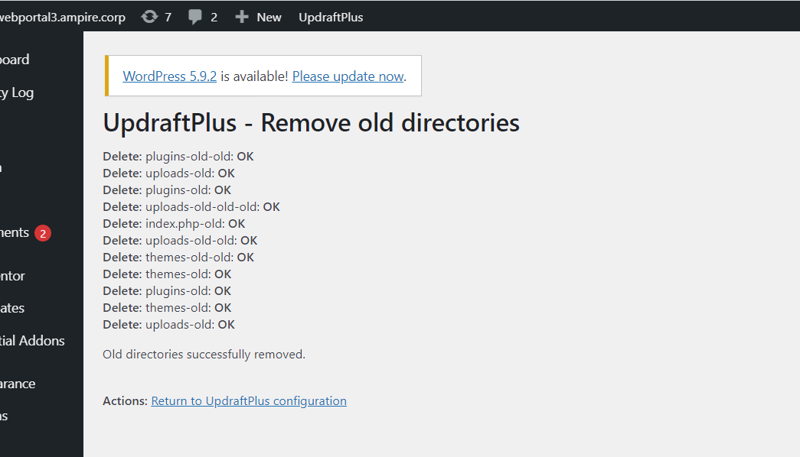{#fig:014 width=70%}

Перейдем к возврату конфигурации, активировав опцию `Return to configuration` (рис. [-@fig:015]):

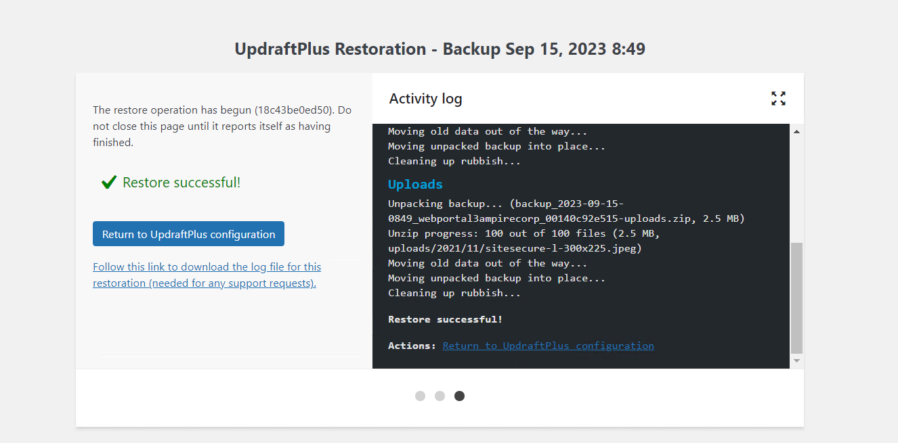{#fig:015 width=70%}

## Последствие уязвимости 1

Чтобы устранить последствие, подключимся к консоли атакуемого устройства. Проверим сокеты уязвимой машины на подключение к определенному порту машины и обнаружим соединение с Kali. Разорвем соединение с нарушителем и проверим, что лишних соединений нет (рис. [-@fig:016]):

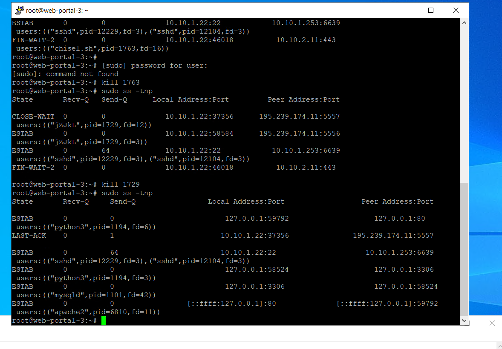{#fig:016 width=70%}

Таким образом, устранили уязвимость, последствия первой уязвимости и закрыли инцидент (рис. [-@fig:017]):

{#fig:017 width=70%}

## Уязвимость 2. CVE 2021-27065.

Вернемся в список событий и обнаружим следующее сигнатурное событие в системе -- возможное нарушение политики информационной безопасности (рис. [-@fig:018]):

{#fig:018 width=70%}

После обнаружения данного события в системе время создать карточку нового инциндента (рис. [-@fig:019]):

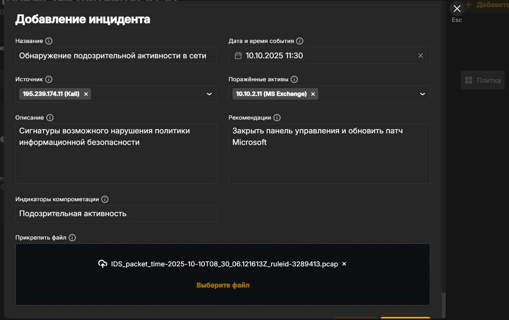{#fig:019 width=70%}

Указав всю необходимую информацию об инцинденте можем перейти к **устранению уязвимости**.

Во время эксплуатации уязвимости `Proxylogon` нарушител совершает `GET` и `POST` запросы к `/ecp`. Достаточно ограничить доступ к указанной директории для запрета эксплуатации уязвимости.

Необходимо выполнить следующие действия:

1. Для открытия `Internet Information Services (IIS) Manager` необходимо нажать сочетание клавиш `Win + R` и в появившемся окне ввести `inetmgr` и нажать `Enter`.

2. В открывшемся окне перейти во вкладку `MAIL\Sites\Default Web Site\ecp` и нажать на `IP Address and Domain Restrictions` (рис. [-@fig:020]):

{#fig:020 width=70%}

3. Далее в «Edit Feature Settings» – «Access for unspecified clients» выбрать пункт «Deny» и нажать «OK» (рис. [-@fig:021]):

{#fig:021 width=70%}

Следует отметить, что индикатор устранения уязвимости не изменится, пока не будет устранено последствие в виде вредоносного `meterpreter`-соединения.

## Последствие уязвимости 2

Уязвимый узел позволяет реализовать следующие виды полезной нагрузки:

1. `meterpreter`-сессия;

2. `web-shell China Chopper`;

3. `registry backdoor`;

4. `file encryption`;

5. `service backdoor`;

6. `IIS backdoor`;

7. добавление пользователя системы `Windows`;

8. `Task Scheduler backdoor`;

9. `SmartScreen Spoof`.

В контексте устранения последствия рассмотрим **meterpreter- сессию**.

### `Meterpreter`-сессия

Данная полезная нагрузка заключается в получении нарушителем `meterpreter`-сессии с уязвимым сервером.

Данную полезную нагрузку можно обнаружить с помощью утилиты `netstat` с ключами `-b` `-c`. В случае установления соединения на уязвимой машине появится сокет с машиной нарушителя. Для закрытия `meterpreter`-сессии необходимо завершить процесс данного соединения с помощью команды `taskkill /PID <PID> /F`. Данная команда в системе `Windows` используется для принудительного завершения процесса. На вход команда `taskkill` получает идентификатор процесса `PID` и параметр команды `/F`, который указывает на принудительное завершение процесса. (рис. [-@fig:022]):

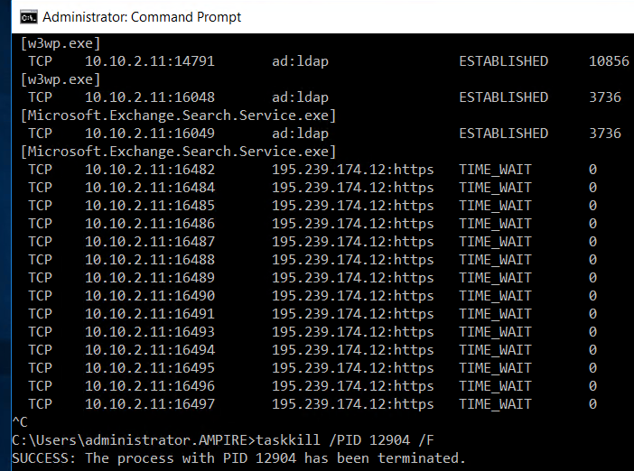{#fig:022 width=70%}

Соединение с нарушителем ликвидировано.

### `Web-shell China Chopper`

Также следует обратить внимание на `Web-shell China Chopper`. `Backdoor «China Chopper»` можно найти в очевидной для таких атак директории `C:\Program Files\Microsoft\Exchange Server\V15\FrontEnd\HttpProxy\owa\auth\AM_backdoor.aspx`.

Большинство РОС (проверок концепций) эксплуатации уязвимости `Proxylogon` записывают файл именно по данному адресу, что выполняется для доступа backdoor без авторизации из веб-директории `owa/auth`. При необходимости полезную нагрузку можно записать в другую директорию.

Для устранения полезной нагрузки необходимо:

- удалить файл веб-оболочки по пути `C:\Program Files\Microsoft\Exchange Server\V15\FrontEnd\HttpProxy\..\auth\` (рис. [-@fig:023]):

{#fig:023 width=70%}

- завершить все соединения между уязвимой машиной и нарушителем (рис. [-@fig:022]).

После проделанных действий, уязвимость 2 и ее последствие будут устранены.

## Уязвимость 3. CVE-2021-22911.

Непосредственно эксплуатацию уязвимости обнаружить при помощи сетевого сенсора `ViPNet IDS NS` не получится, однако успешно детектируются последствия, а именно скачивание вредоносного файла для установки обратного TCP-соединения (`meterpreter`-сессии) и на каком порту установлено соединени е (рис. [-@fig:024]):

{#fig:024 width=70%}

Создадим последнюю карточку инцидента (рис. [-@fig:025]):

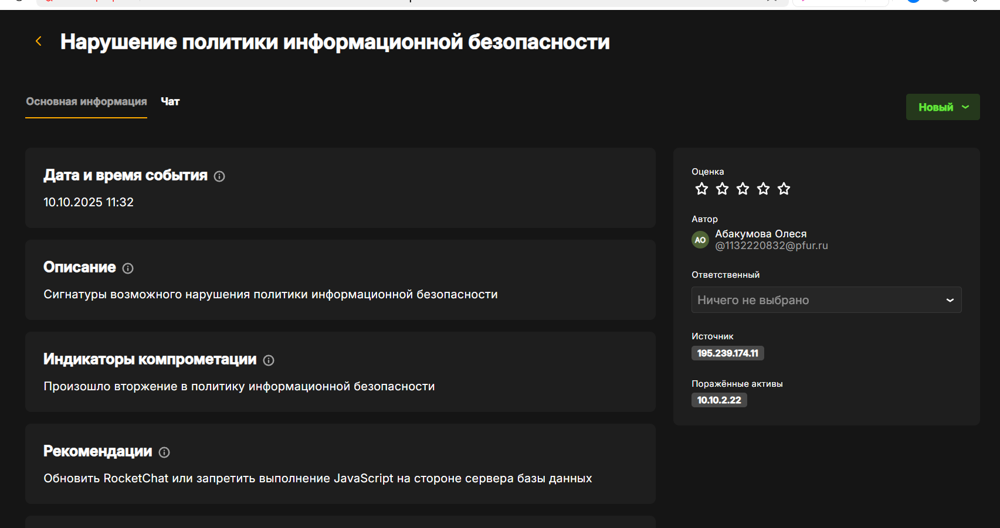{#fig:025 width=70%}

Заполнив все поля, можно перейти к устранению.

Для восстановления доступа к аккаунту администратора необходимо сбросить пароль (рис. [-@fig:026]):

{#fig:026 width=70%}

Письмо с инструкциями для сброса пароля можно прочитать при помощи утилиты `mail` (переключившись на учетную запись `admin`), либо при помощи текстового редактора, прочитав файл `/var/mail/admin` (рис. [-@fig:027]):

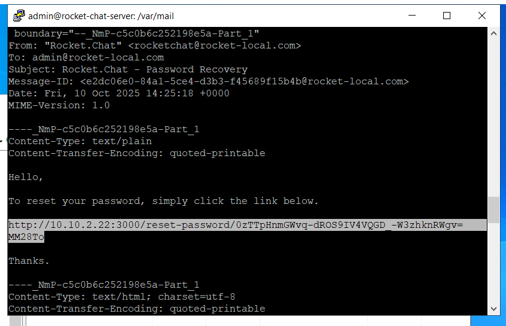{#fig:027 width=70%}

Нужно обратить внимание, что в терминале при переносе строки используется знак «=», его следует игнорировать.

После этого необходимо ввести новый пароль. Для учетной записи администратора `Rocket Chat` настроена двухфакторная аутентификация при помощи `TOTP (Time-based one-time password)`. Для генерации одноразового пароля необходимо воспользоваться программой `Keepass`, доступной на машине администрирования (рис. [-@fig:028]):

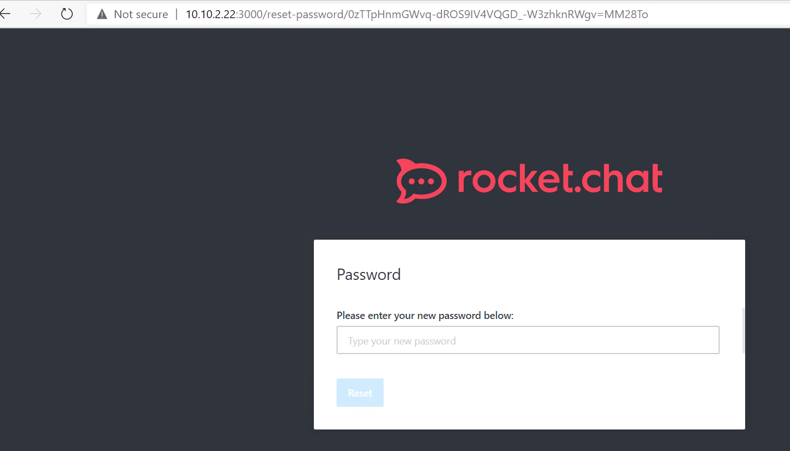{#fig:028 width=70%} 

**Конечно же у меня ничего не получилось с первого раза, но мы не сдаемся.**

## Борьба за вход в Rocket Chat

Если восстановить доступ к учетной записи администратора не получается (не приходит письмо, не находит пользователя), необходимо сначала восстановить БД `rocketchat`.

Проверить наличие БД можно при помощи консоли управления СУБД, подключиться к которой можно командой `mongo`, выполнив команды (рис. [-@fig:029]):

{#fig:029 width=70%} 

Как видно из рисунка, БД `rocketchat` существует (так как были попытки аутентификации в Rocket Chat), однако в ней нет необходимых коллекций для корректного функционирования сервиса (должно быть 72 коллекции). Для восстановления БД можно воспользоваться бэкапом, созданным ранее, или заново проинициализировать БД. Для того чтобы в БД не записывалась никакая «мусорная» информация, необходимо остановить службу `Rocket Chat`. Также удалим базу и проверим корректность удаления (рис. [-@fig:030]):

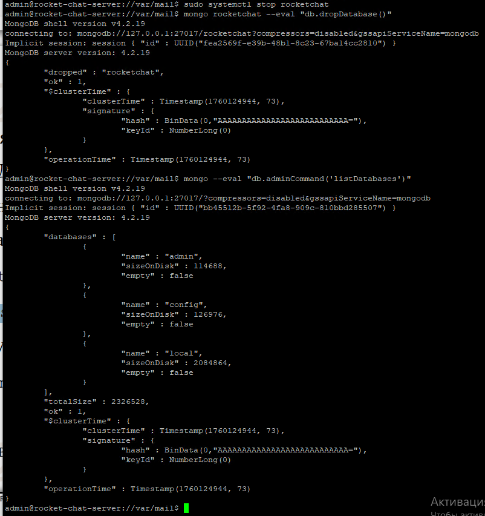{#fig:030 width=70%}

Теперь восстановим БД из бэкапа (рис. [-@fig:031]):

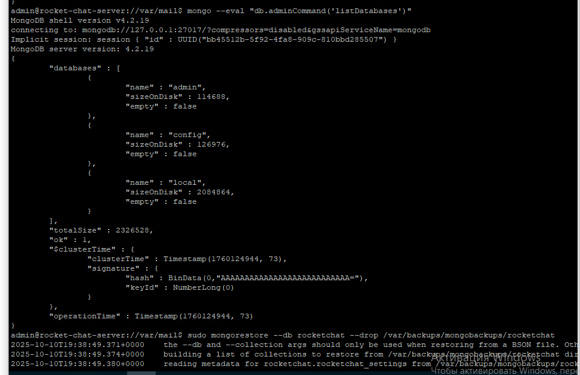{#fig:031 width=70%}

Теперь запустим `RocketChat` и проверим статус (рис. [-@fig:032]):

{#fig:032 width=70%}

На рисунке выше также видно, что БД корректно восстановлена.

Внесем изменения в настройки конфигурации БД. Для этого необходимо отредактировать файл конфигурации БД `/etc/mongod.conf`, добавив строчку `javascriptEnabled: false` (рис. [-@fig:033]):

{#fig:033 width=70%}

Когда параметр `javascriptEnabled` отключен, нельзя использовать операции, выполняющие код `JavaScript` на стороне сервера, такие как `$where`, оператор запроса mapReduce, команды `$accumulator` и `$function`. Для применения настроек необходимо перезапустить службу: `sudo systemctl restart mongod.service`.

Теперь вернемся к входу в `Rocket Chat`. Также выполняем процедуру сброса пароля (рис. [-@fig:026]) и запрашиваем ссылку на почту (рис. [-@fig:027]).
Воспользуемся кодами для восстановлнения, которые записаны в файле `/home/user/backup_codes` (рис. [-@fig:034]):

{#fig:034 width=70%}

Воспользуемся одним из них (рис. [-@fig:035]):

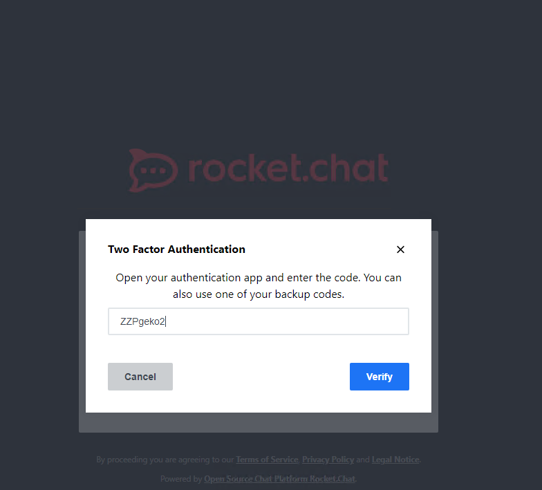{#fig:035 width=70%}

И происходит невероятное, мы заходим в `Rocket Chat` (рис. [-@fig:036]):

{#fig:036 width=70%}

## Устранение последствия уязвимости 3

Чтобы окончательно закрыть уязвимость и последствие мы закроем сессию с наршуителем (рис. [-@fig:037]):

{#fig:037 width=70%}

Закрываем сессию (рис. [-@fig:038]):

{#fig:038 width=70%}

Все инциденты закрыты (рис. [-@fig:039]):

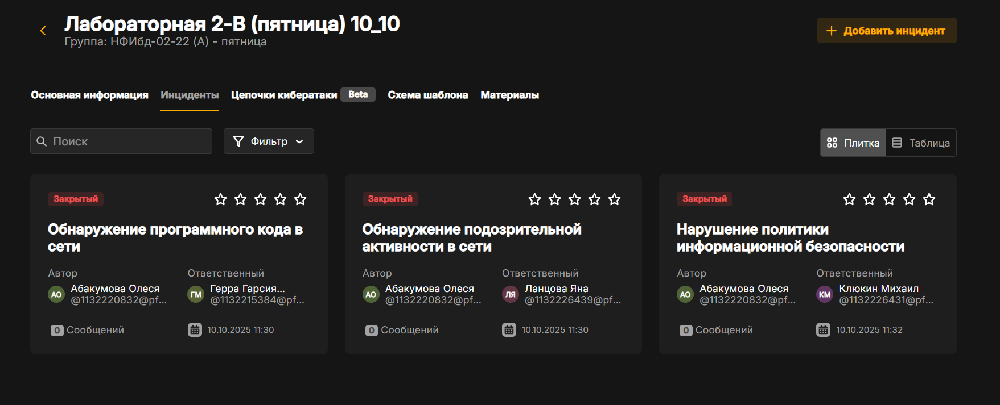{#fig:039 width=70%}

Все уязвимости и последствия устранены (рис. [-@fig:040]):

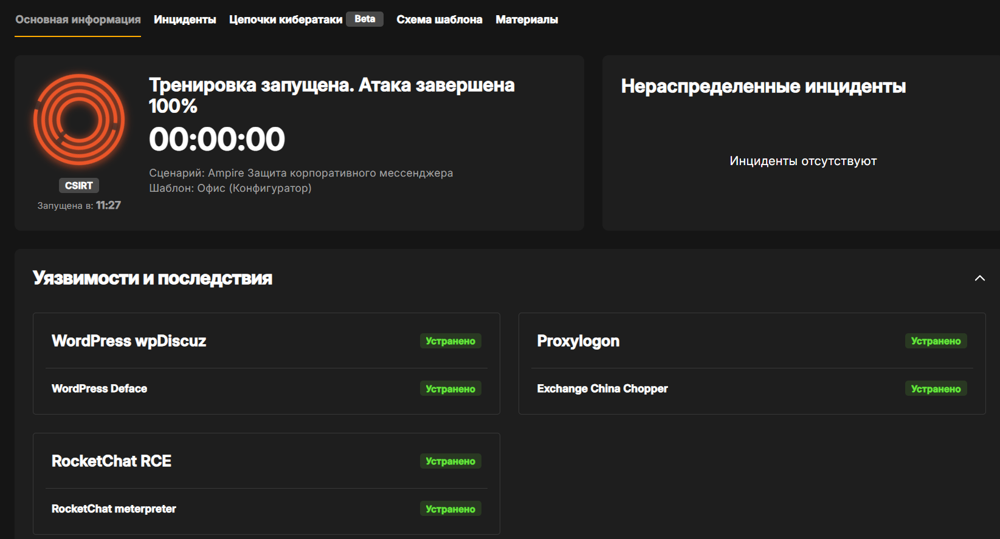{#fig:040 width=70%}

# Выводы

Мы устранили уязвимости и последствия после атаки злоумышленника на сайт Компании с целью получения дсотупа к внутренним ресурсам.