---
## Front matter
lang: ru-RU
title: Лабораторная работа №3
subtitle: "Кибербезопасность предприятия"
author:
  - Абакумова Олеся
  - Герра Гарсия Максимиано Антонио
  - Канева Екатерина
  - Клюкин Михаил
  - Ланцова Яна
institute:
  - Российский университет дружбы народов, Москва, Россия
date: 23 октября 2025

## i18n babel
babel-lang: russian
babel-otherlangs: english

## Formatting pdf
toc: false
toc-title: Содержание
slide_level: 2
aspectratio: 169
section-titles: true
theme: metropolis
header-includes:
 - \metroset{progressbar=frametitle,sectionpage=progressbar,numbering=fraction}
 - \usepackage{fontspec}
 - \usepackage{polyglossia}
 - \setmainlanguage{russian}
 - \setotherlanguage{english}
 - \newfontfamily\cyrillicfont{Arial}
 - \newfontfamily\cyrillicfontsf{Arial}
 - \newfontfamily\cyrillicfonttt{Arial}
 - \setmainfont{Arial}
 - \setsansfont{Arial}
 
---

# Информация

## Состав исследовательской команды

Студенты группы НФИбд-02-22:

  - Абакумова Олеся
  - Герра Гарсия Максимиано Антонио
  - Канева Екатерина
  - Клюкин Михаил
  - Ланцова Яна

:::::::::::::: {.columns align=center}
::: {.column width="70%"}

:::
::::::::::::::

# Цель работы

Защитить научно-техническую информацию предприятия от внутреннего нарушителя.

# Выполнение лабораторной работы

## Уязвимость 1. Слабый пароль пользователя.

{#fig:001 width=70%}

## Уязвимость 1. Слабый пароль пользователя.
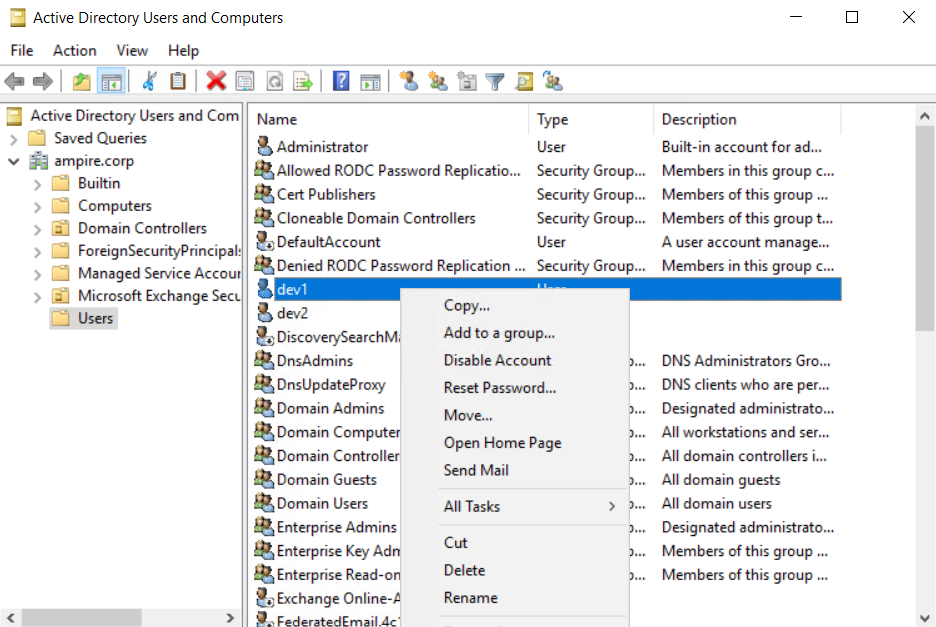{#fig:002 width=70%}

## Уязвимость 1. Слабый пароль пользователя.
{#fig:003 width=70%}

## Уязвимость 1. Слабый пароль пользователя.

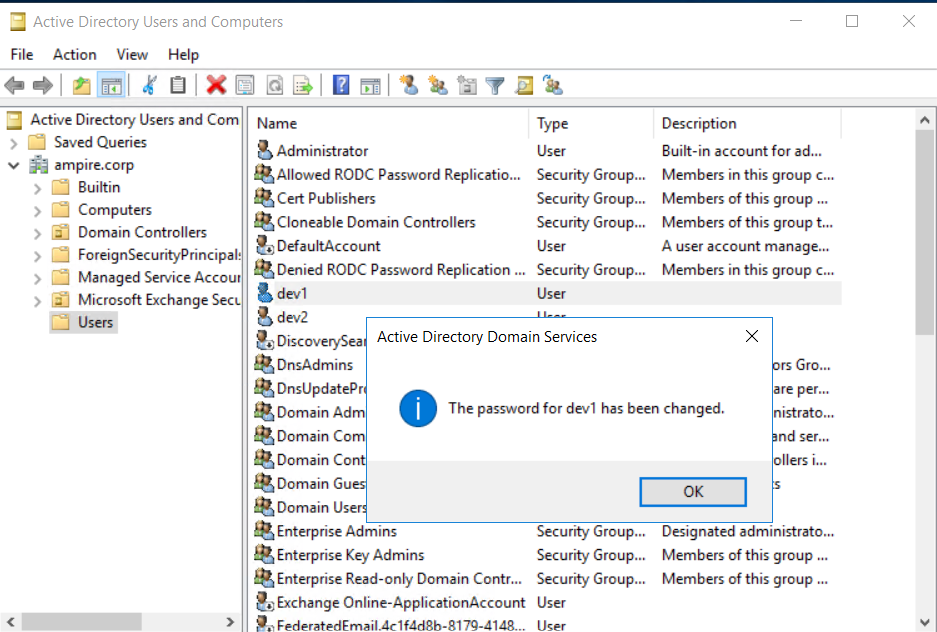{#fig:004 width=70%}

## Уязвимость 1. Слабый пароль пользователя.

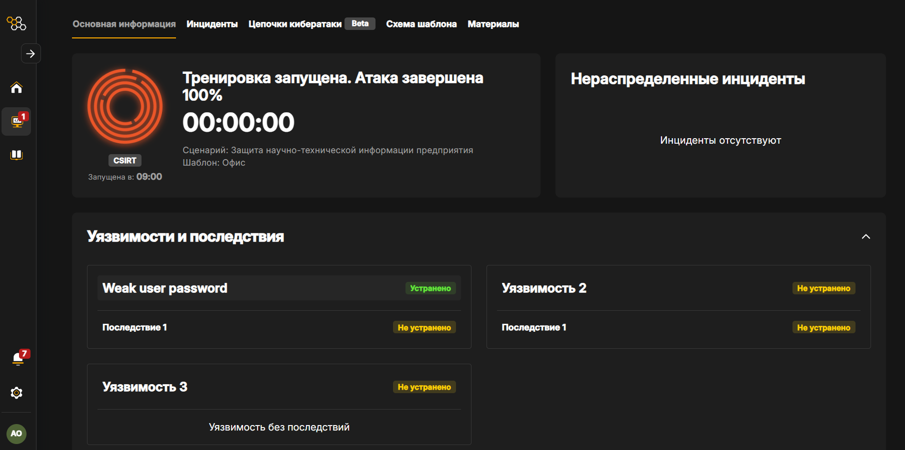{#fig:005 width=70%}

## Последствие уязвимости 1.

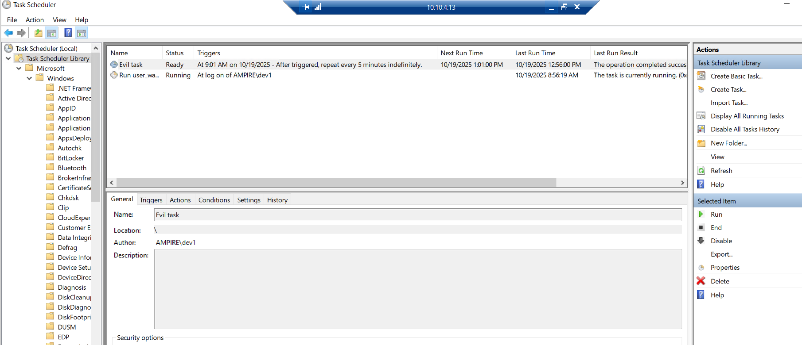{#fig:006 width=70%}

## Последствие уязвимости 1.

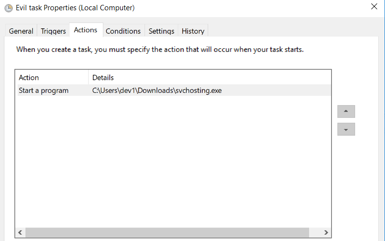{#fig:007 width=70%}

## Последствие уязвимости 1.

{#fig:008 width=70%}

## Последствие уязвимости 1.

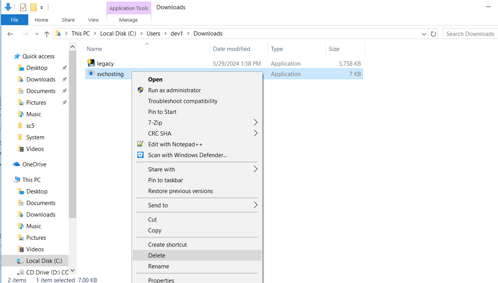{#fig:009 width=70%}

## Последствие уязвимости 1.

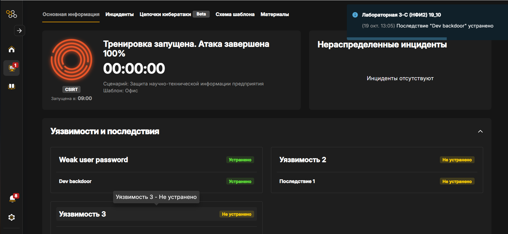{#fig:010 width=70%}

## Уязвимость 2. XSS (CVE-2019-17427).

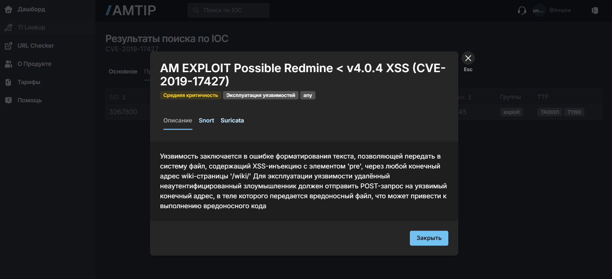{#fig:011 width=70%}

## Уязвимость 2. XSS (CVE-2019-17427).

{#fig:012 width=70%}

## Уязвимость 2. XSS (CVE-2019-17427).

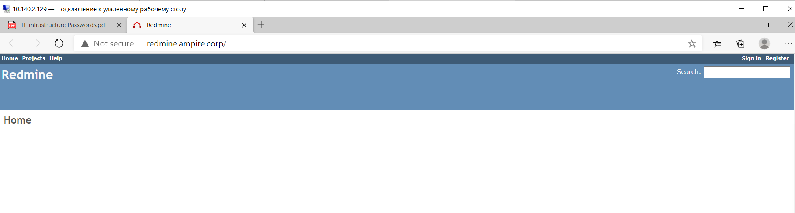{#fig:013 width=70%}

## Уязвимость 2. XSS (CVE-2019-17427).

{#fig:014 width=70%}

## Уязвимость 2. XSS (CVE-2019-17427).

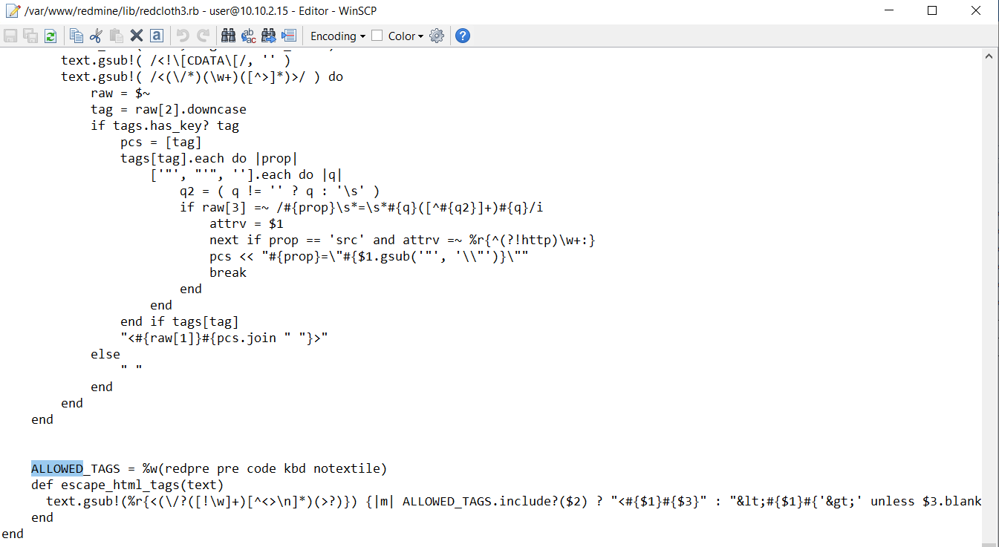{#fig:015 width=70%}

## Уязвимость 2. XSS (CVE-2019-17427).

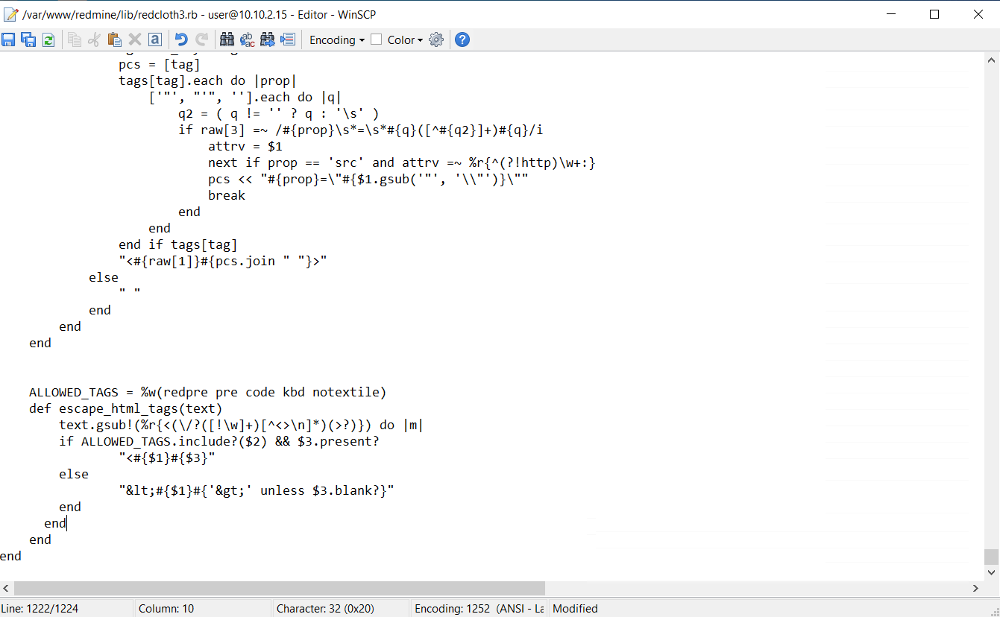{#fig:016 width=70%}

## Уязвимость 2. XSS (CVE-2019-17427).

{#fig:017 width=70%}

## Уязвимость 2. XSS (CVE-2019-17427).

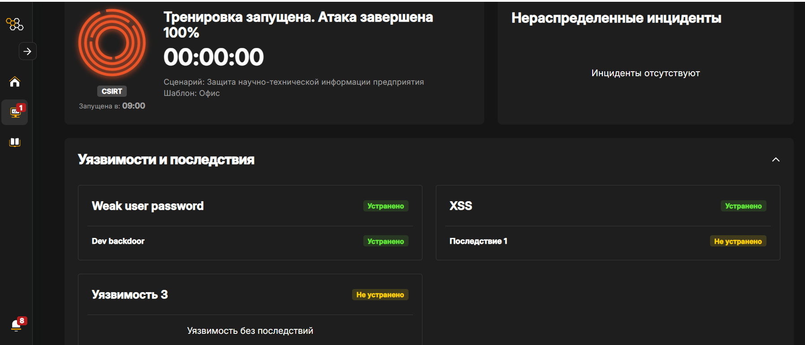{#fig:018 width=70%}

## Последствие уязвимости 2.

{#fig:019 width=70%}

## Последствие уязвимости 2.

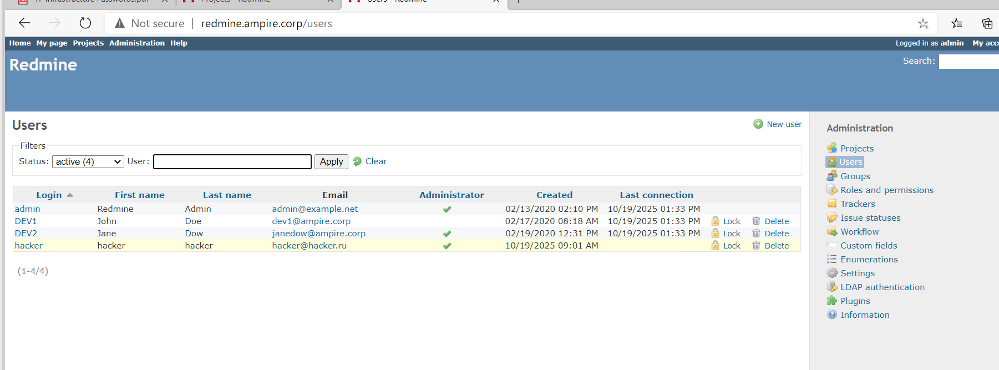{#fig:020 width=70%}

## Последствие уязвимости 2.

{#fig:021 width=70%}

## Последствие уязвимости 2.

{#fig:022 width=70%}

## Последствие уязвимости 2.

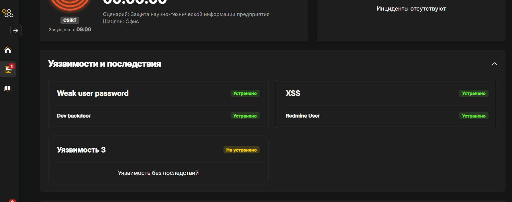{#fig:023 width=70%}

## Уязвимость 3. Blind SQL-инъекция. CVE-2019-18890.

{#fig:024 width=70%}

## Уязвимость 3. Blind SQL-инъекция. CVE-2019-18890.

{#fig:025 width=70%}

## Уязвимость 3. Blind SQL-инъекция. CVE-2019-18890.

{#fig:026 width=70%}

## Уязвимость 3. Blind SQL-инъекция. CVE-2019-18890.

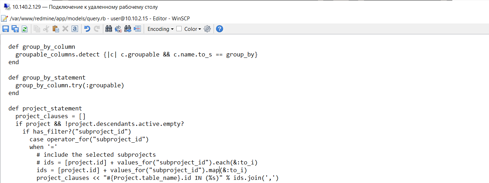{#fig:027 width=70%}

## Уязвимость 3. Blind SQL-инъекция. CVE-2019-18890.

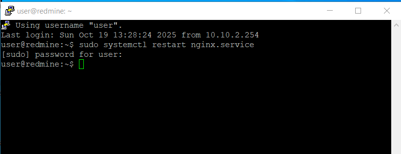{#fig:028 width=70%}

## Уязвимость 3. Blind SQL-инъекция. CVE-2019-18890.

{#fig:029 width=70%}

## Вывод

Мы защитили научно-техническую информацию предприятия от внутреннего нарушителя и устранили последствия его атак.

 