---
## Front matter
title: "Отчёт по лабораторной работе №3"
subtitle: "Кибербезопасность предприятия"
author: |
  | Абакумова Олеся,
  | Герра Гарсия Максимиано Антонио, 
  | Канева Екатерина,
  | Клюкин Михаил, 
  | Ланцова Яна,
  | НФИбд-02-22

## Generic otions
lang: ru-RU
toc-title: "Содержание"

## Bibliography
bibliography: bib/cite.bib
csl: pandoc/csl/gost-r-7-0-5-2008-numeric.csl

## Pdf output format
toc: true # Table of contents
toc-depth: 2
lof: true # List of figures
lot: true # List of tables
fontsize: 12pt
linestretch: 1.5
papersize: a4
documentclass: scrreprt
## I18n polyglossia
polyglossia-lang:
  name: russian
  options:
	- spelling=modern
	- babelshorthands=true
polyglossia-otherlangs:
  name: english
## I18n babel
babel-lang: russian
babel-otherlangs: english
## Fonts
mainfont: IBM Plex Serif
romanfont: IBM Plex Serif
sansfont: IBM Plex Sans
monofont: IBM Plex Mono
mathfont: STIX Two Math
mainfontoptions: Ligatures=Common,Ligatures=TeX,Scale=0.94
romanfontoptions: Ligatures=Common,Ligatures=TeX,Scale=0.94
sansfontoptions: Ligatures=Common,Ligatures=TeX,Scale=MatchLowercase,Scale=0.94
monofontoptions: Scale=MatchLowercase,Scale=0.94,FakeStretch=0.9
mathfontoptions:
## Biblatex
biblatex: true
biblio-style: "gost-numeric"
biblatexoptions:
  - parentracker=true
  - backend=biber
  - hyperref=auto
  - language=auto
  - autolang=other*
  - citestyle=gost-numeric
## Pandoc-crossref LaTeX customization
figureTitle: "Рис."
tableTitle: "Таблица"
listingTitle: "Листинг"
lofTitle: "Список иллюстраций"
lotTitle: "Список таблиц"
lolTitle: "Листинги"
## Misc options
indent: true
header-includes:
  - \usepackage{indentfirst}
  - \usepackage{float} # keep figures where there are in the text
  - \floatplacement{figure}{H} # keep figures where there are in the text
---
# Цель работы

Защитить научно-техническую информацию предприятия от внутреннего нарушителя.

# Выполнение лабораторной работы

## Уязвимость 1. Слабый пароль пользователя.

Поскольку на файловом сервере установлен слабый пароль для входа в учетную запись, нарушитель может подобрать подходящий пароль со словарем.

Изучили уязвимость, добавили инцидент (рис. [-@fig:001]). 

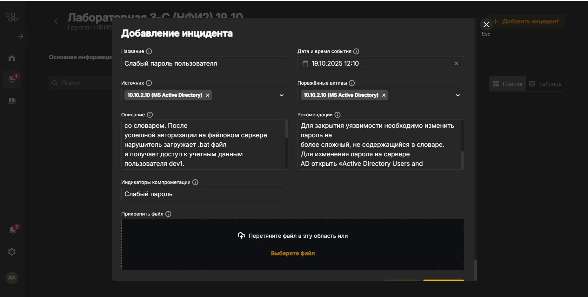{#fig:001 width=70%}

Для устранения уязвимости необходимо изменить простой пароль на сложный, который не содержится в словаре. Для этого на узле Active Directory перейдем в "Active Directory Users and Computers" и найдем пользователя dev1 (рис. [-@fig:002]).

{#fig:002 width=70%}

Установим пользователю новый пароль, который будет содержать числа, лантинские буквы, а также специальные символы (рис. [-@fig:003]). 

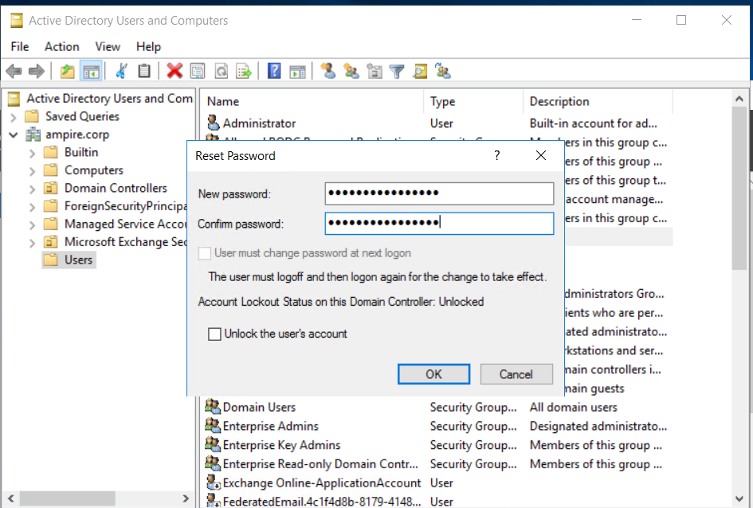{#fig:003 width=70%}

Пароль успешно изменен, злоумышленник не сможет подобрать один из простых паролей (рис. [-@fig:004]).

{#fig:004 width=70%}

После этого убедимся, что уязвимость была закрыта (рис. [-@fig:005]).

{#fig:005 width=70%}

## Последствие уязвимости 1.

Перейдем на узел Developer 1 и устраним первое последствие. Для этого откроем планировщик задач и увидим задачу, которую создал нарушитель(рис. [-@fig:006]).

{#fig:006 width=70%}

В найденной задаче перейдем во вкладку "Actions" и увидим путь к испольняемому файлу злоумышленника (рис. [-@fig:007]).

{#fig:007 width=70%}

Удалим задачу "Evil task" из планировщика задач (рис. [-@fig:008]).

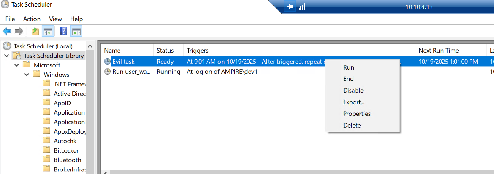{#fig:008 width=70%}

Далее перейдем в директорию `C:\Users\dev1\Downloads` и удалим испольняемый файл, а также удалим его из корзины (рис. [-@fig:009]). 

{#fig:009 width=70%}

После этого убедимся, что последствие для уязвимости было закрыто (рис. [-@fig:010]).

{#fig:010 width=70%}

## Уязвимость 2. XSS (CVE-2019-17427).

Изучим информацию о СVE найденной уязвимости. Увидим, что критичность средняя. Злоумышленик, используя ошибку форматирования текста, может внедрить вредоносный код на веб-страницу Redmine (рис. [-@fig:011]):

{#fig:011 width=70%}

Изучили уязвимость, добавили инцидент (рис. [-@fig:012]).

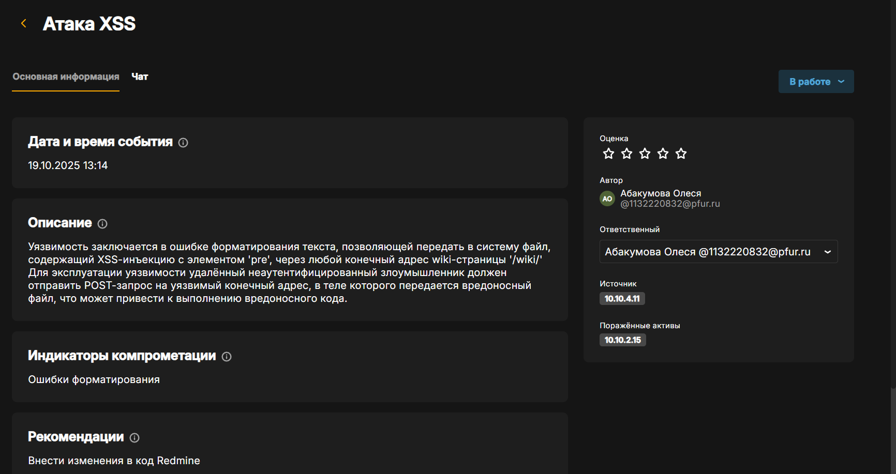{#fig:012 width=70%}

Внесем изменения в код Redmine, чтобы устранить уязвимость. Для начала изучим веб-страницу Redmine (рис. [-@fig:013]).

{#fig:013 width=70%}

Перейдем в каталог `/var/www/redmine/lib` и найдем файл `redcloth3.rb`, который необходимо исправить (рис. [-@fig:014]):

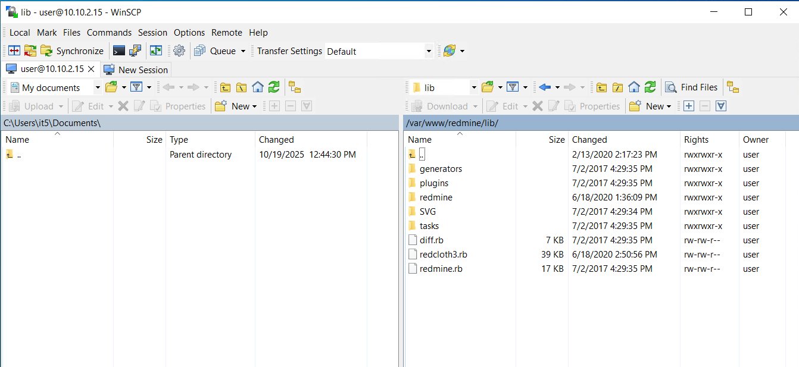{#fig:014 width=70%}

Найдем уязимую часть кода в файле. Изучим содержимое файла, увидим массив `ALLOWED_TAGS`, содержащий теги, которые не экранируются. Это и есть причина уязвимости, позволяющая внедрять JavaScript-код при POST-запросе (рис. [-@fig:015]):

{#fig:015 width=70%}

Исправим файл и добавим функцию `escape_html_tags`, которая будет корректно экранировать HTML-теги, не входящие в белый список `ALLOWED_TAGS`, тем самым предотвращая выполнение внедренного скрипта (рис. [-@fig:016]):

{#fig:016 width=70%}

Сохраним изменения и перезапустим службу веб-сервера (рис. [-@fig:017]):

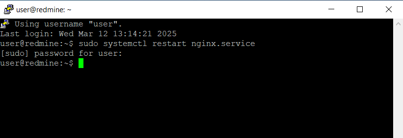{#fig:017 width=70%}

Уязвимость успешно устранена (рис. [-@fig:018]):

{#fig:018 width=70%}

## Последствие уязвимости 2.

Данная полезная нагрузка заключается в том, что нарушитель создает
пользователя на портале Redmine. Пользователь, обладающий правами
администратора, имеет неограниченный доступ к пользовательской базе.

**Примечание:** способ закрытия полезной нагрузки «Redmine User» не
будет действовать до внесения изменений по закрытию уязвимости «Атака
XSS»

Для обнаружения добавления нового привилегированного пользователя,
достаточно зайти в консоль администратора Redmine по ссылке
(http://redmine.ampire.corp/login), перейти в раздел «Administration» – «Users»
и посмотреть список существующих пользователей (рис. [-@fig:019]):

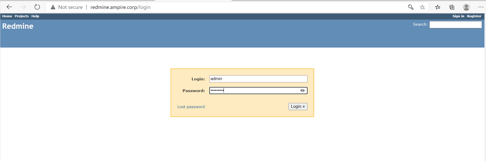{#fig:019 width=70%}

{#fig:020 width=70%}

Для нейтрализации полезной нагрузки необходимо удалить созданного
пользователя «hacker» через веб-интерфейс Redmine (рис. [-@fig:021]):

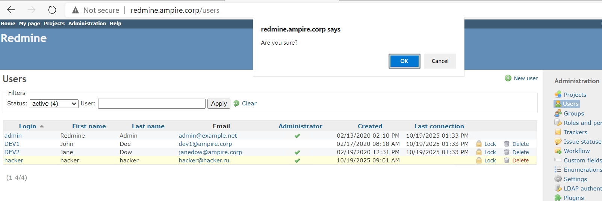{#fig:021 width=70%}

Пользователь hacker успешно удален (рис. [-@fig:022]):

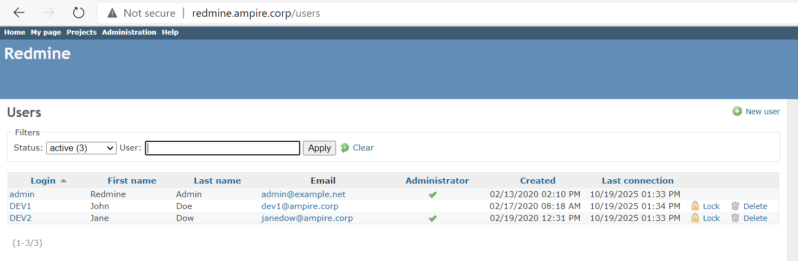{#fig:022 width=70%}

В результате удаления созданного пользователя «hacker» успешно
нейтрализовано последствие Redmine User (рис. [-@fig:023]):

{#fig:023 width=70%}

## Уязвимость 3. Blind SQL-инъекция. CVE-2019-18890.

В Redmine до версии 3.2.9 и 3.3.x до версии 3.3.10 уязвимость позволяет
пользователям Redmine получать доступ к защищенной информации с
помощью сгенерированного объектного запроса. Уязвимость реализуется
посимвольным перебором с замером времени ответа. В данном сценарии
данная уязвимость используется для получения конфиденциальной
информации из БД, минуя разграничение доступа Redmine. Время прихода пакета является индикатором: при запоздании
пакета – символ подобран верно, иначе – перебор продолжается.

Посмотрим информацию об эксплуатируемой уязвимости CVE-2019-18890 (рис. [-@fig:024]):

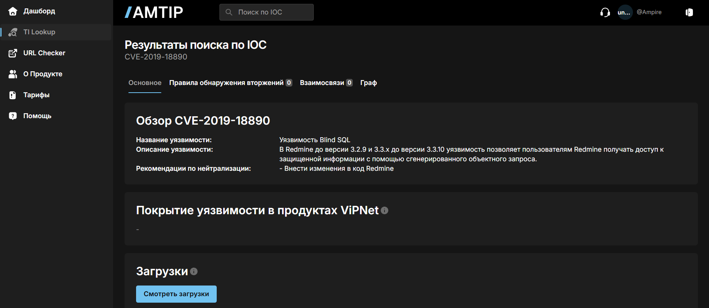{#fig:024 width=70%}

Создаем карточку инцидента (рис. [-@fig:025]):

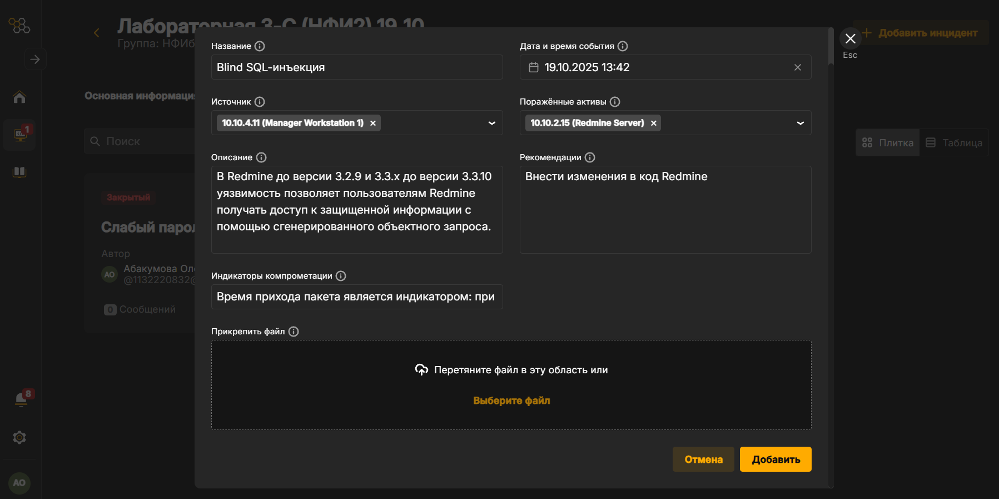{#fig:025 width=70%}

**Решение:** внести изменения в код Redmine.
Исходя из адреса и запроса следует найти местоположение скрипта, где
происходит обработка параметра subproject_id. В данном случае рассмотрен
файл query.rb. Данный файл находится в директории
/var/www/redmine/app/models (рис. [-@fig:026]):

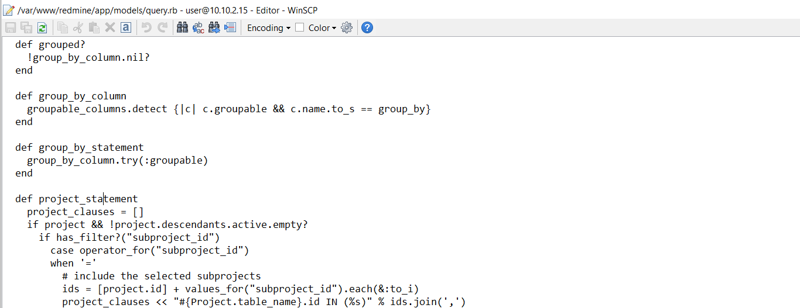{#fig:026 width=70%}

В данном случае следует добавить фильтрацию значений и
закомментировать код (рис. [-@fig:027]):

{#fig:027 width=70%}

После внесения изменений необходимо перезапустить службу
веб-сервера: `sudo systemctl restart nginx.service`(рис. [-@fig:028]):

{#fig:028 width=70%}

Убедимся в том, что все уязвимости и последствия устранены (рис. [-@fig:029]):

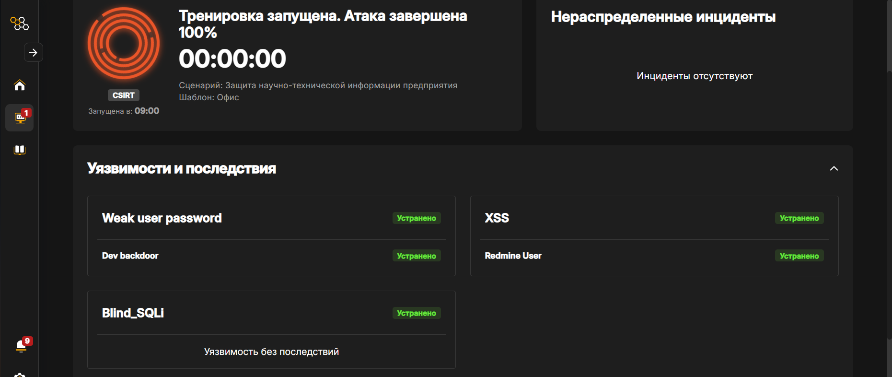{#fig:029 width=70%}

# Вывод

Мы защитили научно-техническую информацию предприятия от внутреннего нарушителя и устранили последствия его атак.

 
