---
## Front matter
lang: ru-RU
title: Лабораторная работа №4
subtitle: "Кибербезопасность предприятия"
author:
  - Абакумова Олеся
  - Герра Гарсия Максимиано Антонио
  - Ланцова Яна
institute:
  - Российский университет дружбы народов, Москва, Россия
date: 23 октября 2025

## i18n babel
babel-lang: russian
babel-otherlangs: english

## Formatting pdf
toc: false
toc-title: Содержание
slide_level: 2
aspectratio: 169
section-titles: true
theme: metropolis
header-includes:
 - \metroset{progressbar=frametitle,sectionpage=progressbar,numbering=fraction}
mainfont: Open Sans Light
---

# Информация

## Состав исследовательской команды

Студенты группы НФИбд-02-22:

  - Абакумова Олеся
  - Герра Гарсия Максимиано Антонио
  - Ланцова Яна

:::::::::::::: {.columns align=center}
::: {.column width="70%"}

:::
::::::::::::::

# Цель работы

Освоить методы обнаружения, анализа и эксплуатации уязвимостей на почтовом сервере Microsoft Exchange для получения несанкционированного доступа к защищенной системе.

# Выполнение лабораторной работы

## Разведка на предмет поиска вектора атаки.

{#fig:001 width=70%}

## Разведка на предмет поиска вектора атаки.

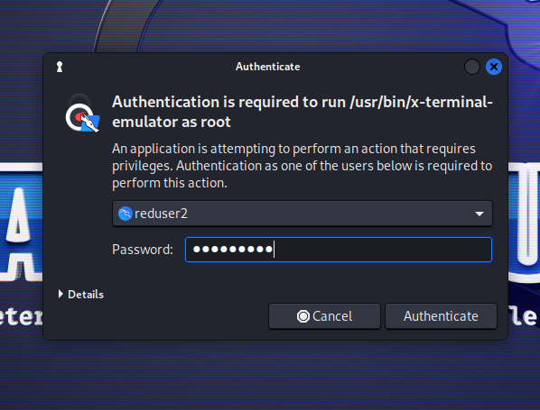{#fig:002 width=50%}

## Разведка на предмет поиска вектора атаки.

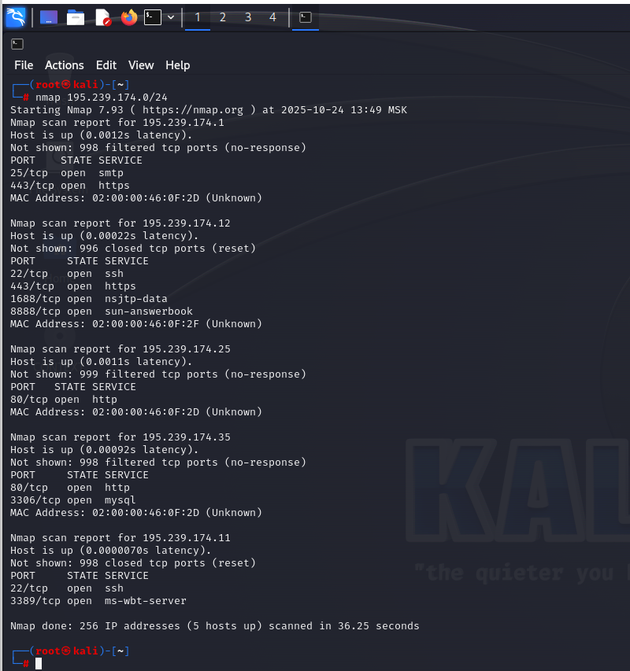{#fig:003 width=50%}

## Разведка на предмет поиска вектора атаки.

{#fig:004 width=70%}

## Разведка на предмет поиска вектора атаки.

{#fig:005 width=50%}

## Разведка на предмет поиска вектора атаки.

{#fig:006 width=70%}

## Разведка на предмет поиска вектора атаки.

{#fig:007 width=70%}

## Разведка на предмет поиска вектора атаки.

{#fig:008 width=70%}

## Разведка на предмет поиска вектора атаки.

{#fig:009 width=70%}

## Разведка на предмет поиска вектора атаки.

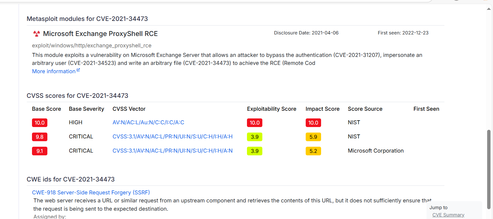{#fig:010 width=70%}

## Разведка на предмет поиска вектора атаки.

{#fig:011 width=70%}

## Разведка на предмет поиска вектора атаки.

{#fig:012 width=70%}

## Использование уязвимости ProxyShell.

Используемый модуль эксплуатирует уязвимость на сервере Microsoft Exchange, которая позволяет злоумышленнику обойти аутентификацию и выдать себя за произвольного пользователя. Вследствие чего атакующий может записать произвольный файл для достижения RCE.

## Использование уязвимости ProxyShell.

{#fig:013 width=70%}

## Использование уязвимости ProxyShell.

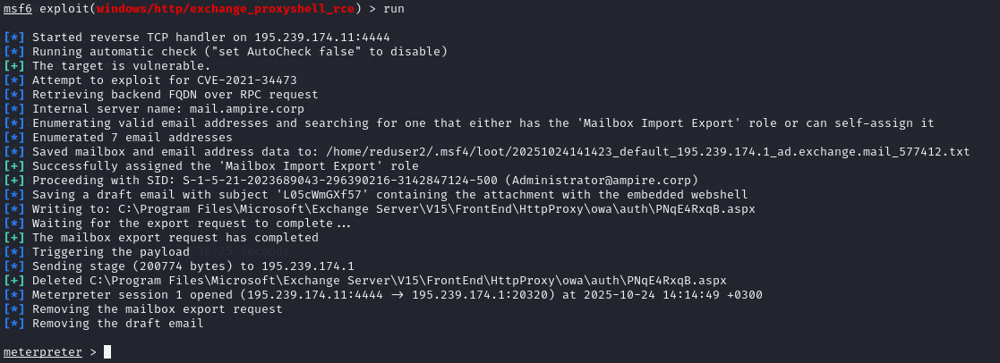{#fig:014 width=70%}

## Использование уязвимости ProxyShell.

{#fig:015 width=70%}

## Использование уязвимости ProxyShell.

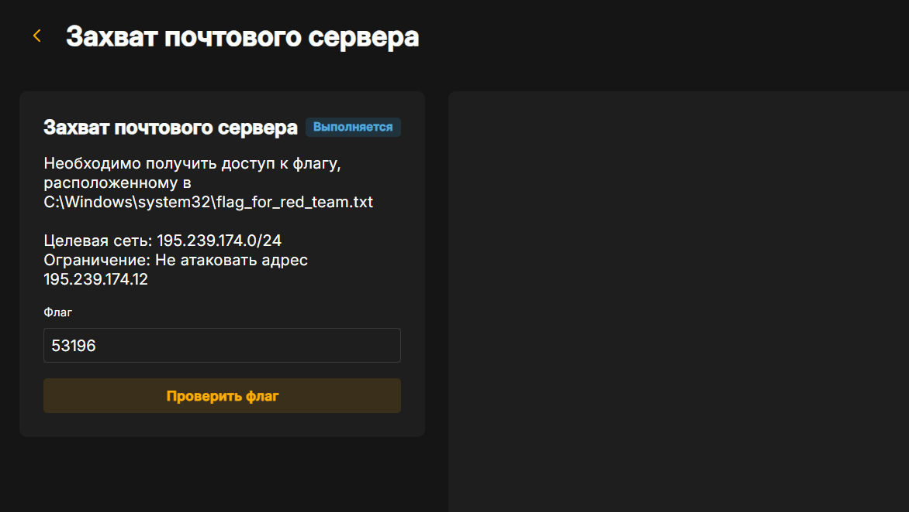{#fig:016 width=70%}

## Использование уязвимости ProxyShell.

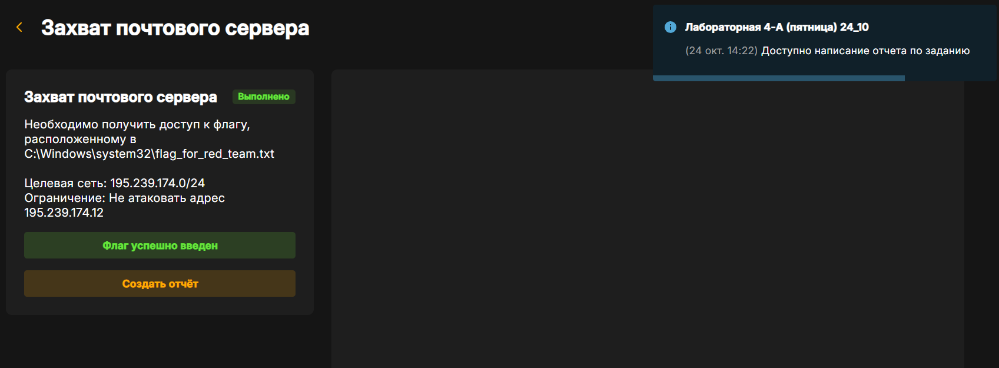{#fig:017 width=70%}

## Эксплуатация уязвимости ProxyLogon.

Альтернативным способом захвата флага является эксплуатация
уязвимости ProxyLogon.
Уязвимость ProxyLogon CVE-2021-26855 (SSRF) позволяет внешнему
атакующему обойти механизм аутентификации в MS Exchange и выдать себя
за любого пользователя. С помощью подделанного запроса на стороне сервера атакующий может отправить произвольный HTTP-запрос, который будетперенаправлен к другому внутреннему сервису, от имени машинного аккаунта
почтового сервера. Для эксплуатации данной уязвимости нужно получить доступ к почтовому ящику одного из пользователей почтового сервиса.

## Эксплуатация уязвимости ProxyLogon.

{#fig:018 width=70%}

## Эксплуатация уязвимости ProxyLogon.

{#fig:019 width=70%}

## Эксплуатация уязвимости ProxyLogon.

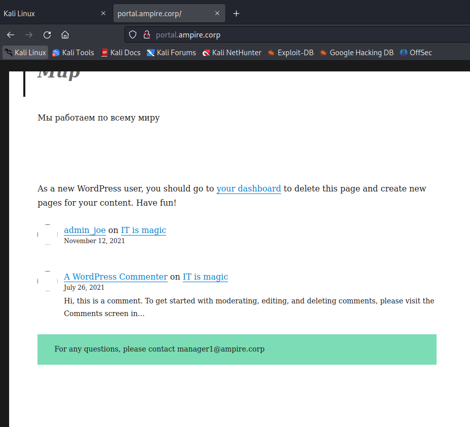{#fig:020 width=50%}

## Эксплуатация уязвимости ProxyLogon.

{#fig:021 width=70%}

## Эксплуатация уязвимости ProxyLogon.

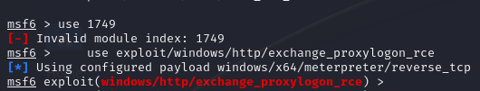{#fig:022 width=70%}

## Эксплуатация уязвимости ProxyLogon.

{#fig:023 width=70%}

## Эксплуатация уязвимости ProxyLogon.

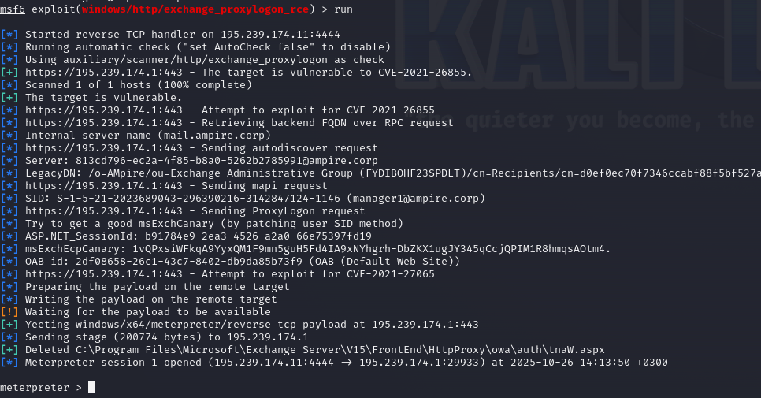{#fig:024 width=70%}

## Эксплуатация уязвимости ProxyLogon.

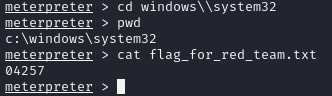{#fig:025 width=70%}

## Эксплуатация уязвимости ProxyLogon.

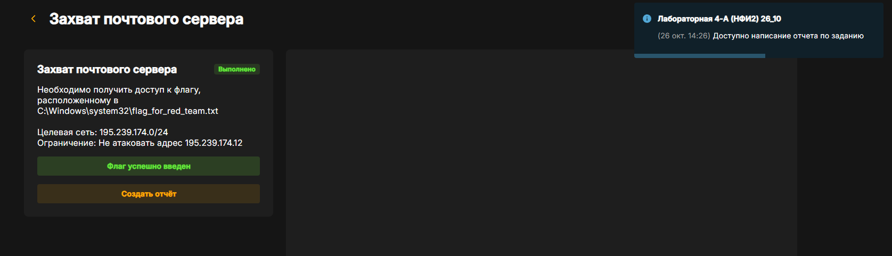{#fig:026 width=70%}

# Вывод

Мы освоили методы обнаружения, анализа и эксплуатации уязвимостей на почтовом сервере Microsoft Exchange для получения несанкционированного доступа к защищенной системе.
