---
## Front matter
title: "Отчёт по лабораторной работе №4"
subtitle: "Кибербезопасность предприятия"
author: |
  | Абакумова Олеся,
  | Герра Гарсия Максимиано Антонио, 
  | Ланцова Яна,
  | НФИбд-02-22

## Generic otions
lang: ru-RU
toc-title: "Содержание"

## Bibliography
bibliography: bib/cite.bib
csl: pandoc/csl/gost-r-7-0-5-2008-numeric.csl

## Pdf output format
toc: true # Table of contents
toc-depth: 2
lof: true # List of figures
lot: true # List of tables
fontsize: 12pt
linestretch: 1.5
papersize: a4
documentclass: scrreprt
## I18n polyglossia
polyglossia-lang:
  name: russian
  options:
    - spelling=modern
    - babelshorthands=true
polyglossia-otherlangs:
  name: english
## I18n babel
babel-lang: russian
babel-otherlangs: english
## Fonts
mainfont: IBM Plex Serif
romanfont: IBM Plex Serif
sansfont: IBM Plex Sans
monofont: IBM Plex Mono
mathfont: STIX Two Math
mainfontoptions: Ligatures=Common,Ligatures=TeX,Scale=0.94
romanfontoptions: Ligatures=Common,Ligatures=TeX,Scale=0.94
sansfontoptions: Ligatures=Common,Ligatures=TeX,Scale=MatchLowercase,Scale=0.94
monofontoptions: Scale=MatchLowercase,Scale=0.94,FakeStretch=0.9
mathfontoptions:
## Biblatex
biblatex: true
biblio-style: "gost-numeric"
biblatexoptions:
  - parentracker=true
  - backend=biber
  - hyperref=auto
  - language=auto
  - autolang=other*
  - citestyle=gost-numeric
## Pandoc-crossref LaTeX customization
figureTitle: "Рис."
tableTitle: "Таблица"
listingTitle: "Листинг"
lofTitle: "Список иллюстраций"
lotTitle: "Список таблиц"
lolTitle: "Листинги"
## Misc options
indent: true
header-includes:
  - \usepackage{indentfirst}
  - \usepackage{float} # keep figures where there are in the text
  - \floatplacement{figure}{H} # keep figures where there are in the text
---

# Цель работы

Освоить методы обнаружения, анализа и эксплуатации уязвимостей на почтовом сервере Microsoft Exchange для получения несанкционированного доступа к защищенной системе.

# Выполнение лабораторной работы

## Разведка на предмет поиска вектора атаки.

Подключимся к удаленному рабочему столу атакующего и залогинемся под пользователем (рис. [-@fig:001]). 

{#fig:001 width=70%}

Запустим терминал `Root Terminal Emulator` и пройдем аутентификацию из-под пользователя root (рис. [-@fig:002]).

{#fig:002 width=70%}

С помощью утилиты `nmap` просканируем подсеть 195.239.174.0/24 для поиска открытых портов, которые можно будет использовать для атаки на инфраструктуру (рис. [-@fig:003]). 

{#fig:003 width=70%}

Увидим, что на хосте 195.239.174.1 открыты порты 25 и 443. Первый порт (SMTP) передает электронные письма между почтовыми сервисами. В то время как второй (HTTPS) направлен на защищенную работу веб-трафика. Наличие данных портов указывает на потенциальный почтовый сервер.

Убедимся, что на хосте действительно установлен почтовый сервер. В браузере перейдем по адресу `https://195.239.174.1` и увидим интерфейс входа в систему Microsoft Outlook Web Access. Это окончательно подтверждает, что на данном хосте действительно работает почтовый сервер (рис. [-@fig:004]).

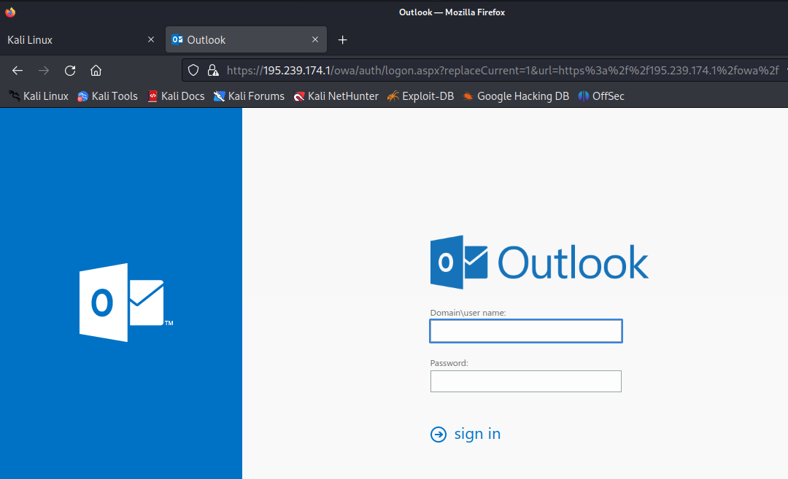{#fig:004 width=70%}

Определим версию программного обеспечения Exchange Server, чтобы найти уявзимости. Для этого зайдем в режим разработчика и изучим разметку представленной HTML страницы. Увидим тег `<link>`, который содержит номер сборки или версию Exchange (рис. [-@fig:005]).

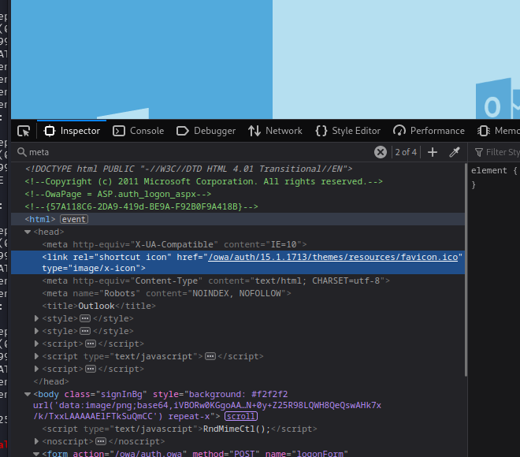{#fig:005 width=70%}

Посмотрим официальную документацию Microsoft (рис. [-@fig:006]), где указаны даты выпуска различных версий Exchange Server. Сопоставим найденную на предыдущем шаге версию сервера с этой таблицей, чтобы определить точную дату выпуска.

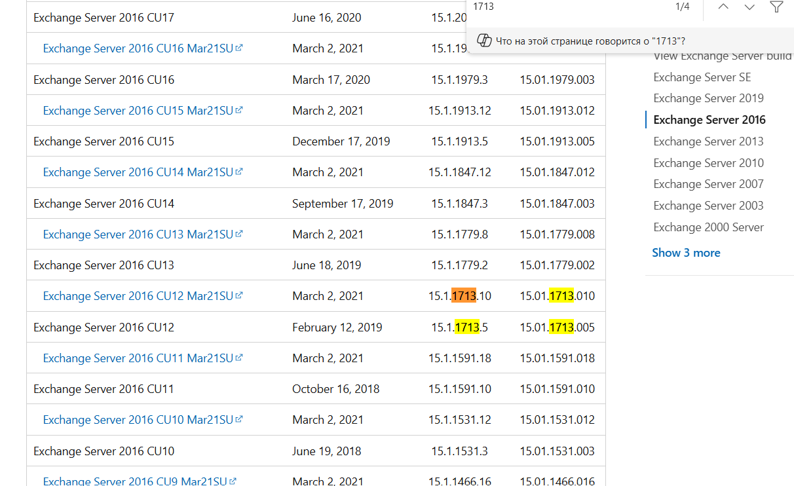{#fig:006 width=70%}

В найденной задаче перейдем во вкладку "Actions" и увидим путь к испольняемому файлу злоумышленника (рис. [-@fig:007]).

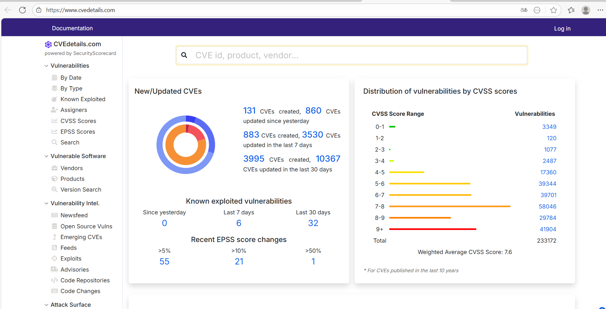{#fig:007 width=70%}

Для дальнейшего планирования вектора атаки используем веб-сайт `https://www.cvedetails.com`. Перейдем в раздел со школой "опасности" для различных уязвимостей (рис. [-@fig:008]).

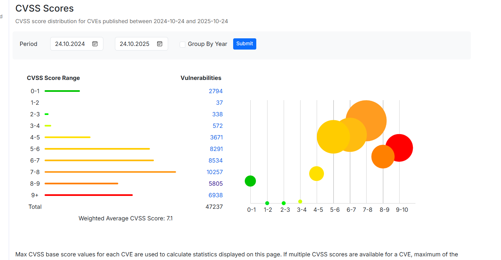{#fig:008 width=70%}

Изучим только самые опасные уязвимости, оценка которых больше или равна 9 (рис. [-@fig:009]). Будем искать CVE с пометкой "public exploit exists", чтобы была возможность эксплуатации.

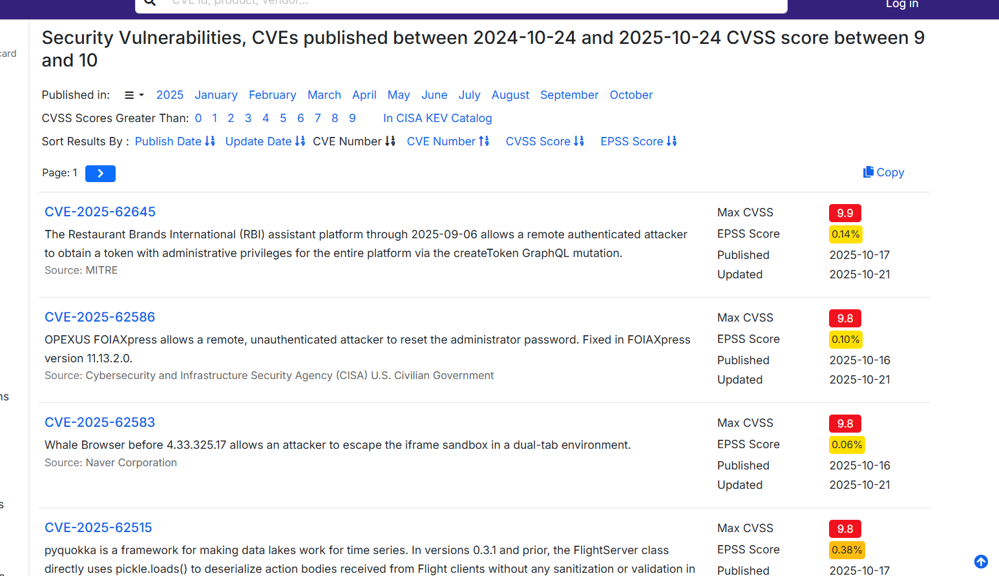{#fig:009 width=70%}

Найдем уязвимсоть `CVE-2021-34473` и увидим, что первая дата раскрытия информации по уязвимости больше даты выпуска сборки атакуемого почтового сервера (рис. [-@fig:010]). Тогда, данную уязвимость можно эксплуатировать.

{#fig:010 width=70%}

Найденная уязвимость входит в цепочку ProxyLogon. Указано, что для данной CVE существует модуль в фреймворке Metasploit. Аналогично предыдущему рисунку, также указаны даты раскрытия уязвимости (рис. [-@fig:011]).

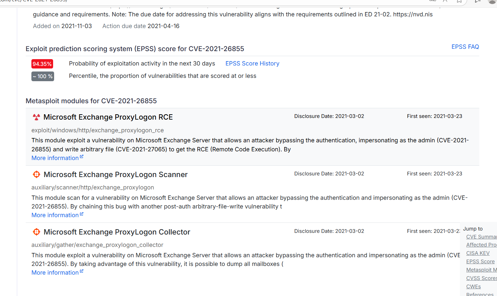{#fig:011 width=70%}

Запустим Metasploit framework. Для поиска возможных векторов атаки проведем дальнейшее сканирование с помощью команды `search` (рис. [-@fig:012]).

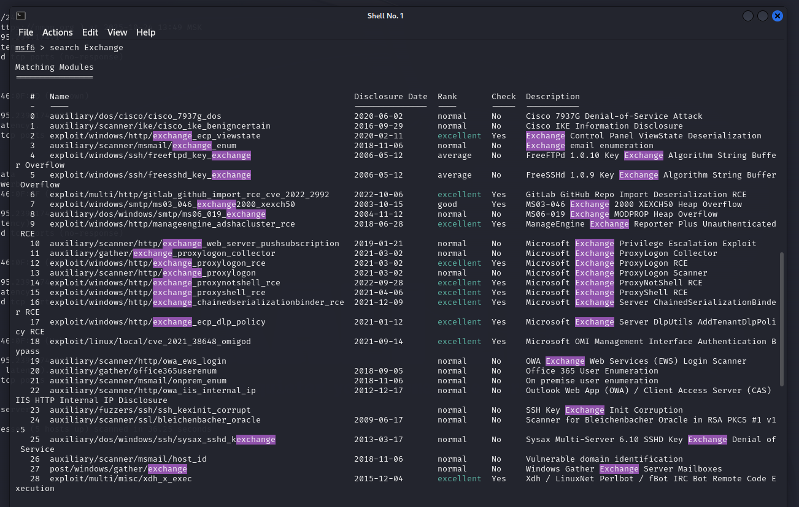{#fig:012 width=70%}

Стало понятно, что нужно получить сессию с удаленным хостом 195.239.174.1 с использованием RCE для захвата флага. Будем эксплуатировать возможность RCE двумя модулями.

## Использование уязвимости ProxyShell.

Используемый модуль эксплуатирует уязвимость на сервере Microsoft Exchange, которая позволяет злоумышленнику обойти аутентификацию и выдать себя за произвольного пользователя. Вследствие чего атакующий может записать произвольный файл для достижения RCE.

Воспользуемся модулем `windows/http/exchange_proxyshell_rce`. Зададим следующие параметры: IP-адрес атакующей машины, IP-адрес целевой системы (рис. [-@fig:013]).

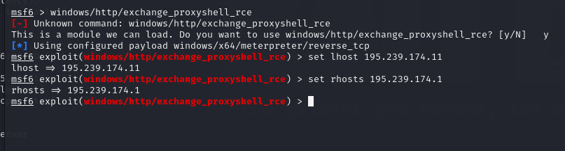{#fig:013 width=70%}

Запустим модуль ProxyShell и получим meterpeter-сессию с помощью команды `run`. В консоли виден многоэтапный процесс атаки (рис. [-@fig:014]). Также увидим информацию о том, что была обнаружена и проэксплуатирована уязвимость `CVE-2021-34473`.

{#fig:014 width=70%}

Из сессии Meterpreter читаем содержимое файла, используя команду `C:/windows/system32/flag_for_red_team.txt` (рис. [-@fig:015]):

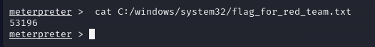{#fig:015 width=70%}

Перейдем в Ampire и укажем выведенный флаг (рис. [-@fig:016]):

{#fig:016 width=70%}

Убедимся, что флаг была найден и введен правильно (рис. [-@fig:017]):

{#fig:017 width=70%}

## Эксплуатация уязвимости ProxyLogon.

Альтернативным способом захвата флага является эксплуатация
уязвимости ProxyLogon.
Уязвимость ProxyLogon CVE-2021-26855 (SSRF) позволяет внешнему
атакующему обойти механизм аутентификации в MS Exchange и выдать себя
за любого пользователя. С помощью подделанного запроса на стороне сервера атакующий может отправить произвольный HTTP-запрос, который будетперенаправлен к другому внутреннему сервису, от имени машинного аккаунта
почтового сервера. Для эксплуатации данной уязвимости нужно получить доступ к почтовому ящику одного из пользователей почтового сервиса.

Первоочередно необходимо внести изменения в файл /etc/hosts (рис. [-@fig:018]):

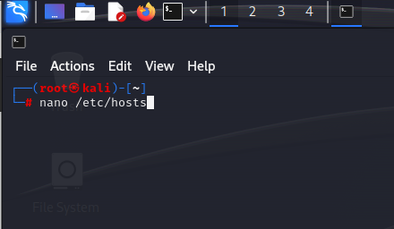{#fig:018 width=70%}

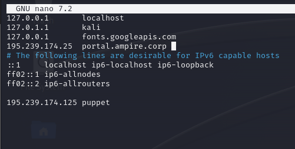{#fig:019 width=70%}

В нижней части страницы портала portal.ampire.corp можно найти информацию о легитимной почте одного из сотрудников (рис. [-@fig:020]):

{#fig:020 width=70%}

Далее найдем уязвимость в списке, которую убдем использовать (рис. [-@fig:021]):

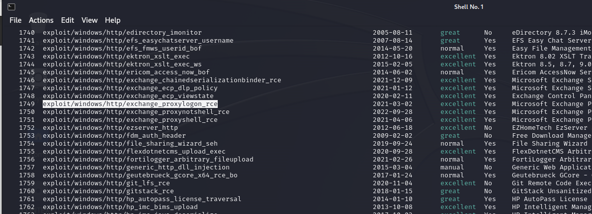{#fig:021 width=70%}

Используем ее (рис. [-@fig:022]):

{#fig:022 width=70%}

С использованием почты manager1@ampire.corp (рис. [-@fig:020]) можно
применить данный модуль для получения соединения с удаленным узлом. Далее задать все необходимые параметры для модуля (рис. [-@fig:023]):

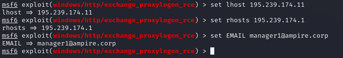{#fig:023 width=70%}

Следующим шагом запустить эксплуатацию уязвимости ProxyLogon (рис. [-@fig:024]):

{#fig:024 width=70%}

После получения сессии с почтовым сервером можно найти флаг по пути `С:\Windows\system32` в файле `flag_for_red_team.txt` (рис. [-@fig:025]):

{#fig:025 width=70%}

Флаг успешно введен (рис. [-@fig:026]):

{#fig:026 width=70%}

# Вывод

Мы освоили методы обнаружения, анализа и эксплуатации уязвимостей на почтовом сервере Microsoft Exchange для получения несанкционированного доступа к защищенной системе.
