---
## Front matter
title: "Отчёт по лабораторной работе №5"
subtitle: "Кибербезопасность предприятия"
author: |
  | Абакумова Олеся,
  | Герра Гарсия Максимиано Антонио, 
  | Ланцова Яна,
  | НФИбд-02-22

## Generic otions
lang: ru-RU
toc-title: "Содержание"

## Bibliography
bibliography: bib/cite.bib
csl: pandoc/csl/gost-r-7-0-5-2008-numeric.csl

## Pdf output format
toc: true # Table of contents
toc-depth: 2
lof: true # List of figures
lot: true # List of tables
fontsize: 12pt
linestretch: 1.5
papersize: a4
documentclass: scrreprt
## I18n polyglossia
polyglossia-lang:
  name: russian
  options:
    - spelling=modern
    - babelshorthands=true
polyglossia-otherlangs:
  name: english
## I18n babel
babel-lang: russian
babel-otherlangs: english
## Fonts
mainfont: IBM Plex Serif
romanfont: IBM Plex Serif
sansfont: IBM Plex Sans
monofont: IBM Plex Mono
mathfont: STIX Two Math
mainfontoptions: Ligatures=Common,Ligatures=TeX,Scale=0.94
romanfontoptions: Ligatures=Common,Ligatures=TeX,Scale=0.94
sansfontoptions: Ligatures=Common,Ligatures=TeX,Scale=MatchLowercase,Scale=0.94
monofontoptions: Scale=MatchLowercase,Scale=0.94,FakeStretch=0.9
mathfontoptions:
## Biblatex
biblatex: true
biblio-style: "gost-numeric"
biblatexoptions:
  - parentracker=true
  - backend=biber
  - hyperref=auto
  - language=auto
  - autolang=other*
  - citestyle=gost-numeric
## Pandoc-crossref LaTeX customization
figureTitle: "Рис."
tableTitle: "Таблица"
listingTitle: "Листинг"
lofTitle: "Список иллюстраций"
lotTitle: "Список таблиц"
lolTitle: "Листинги"
## Misc options
indent: true
header-includes:
  - \usepackage{indentfirst}
  - \usepackage{float} # keep figures where there are in the text
  - \floatplacement{figure}{H} # keep figures where there are in the text
---

# Цель работы

Создать на контроллере домена пользователя hacker и добавить его в группу локальных администраторов. Получить в результате выполнения флаг в одном из полей созданного пользователя.

# Выполнение лабораторной работы

## Поиск почтового сервера.

Подключимся к удаленному рабочему столу атакующего и откроем терминал(рис. [-@fig:001]). 

{#fig:001 width=70%}

Отображены результаты сканирования подсети 195.239.174.0/24 утилитой nmap. Выявлен 

Просканируем подсеть 195.239.174.0/24 для поиска открытых портов, которые можно использовать для атаки на инфраструктуру. Для этого используем утилиту nmap (рис. [-@fig:002]).

{#fig:002 width=70%}

Увидим хост 195.239.174.1 с открытыми портами 25 (SMTP) и 443 (HTTPS), что указывает на потенциальный почтовый сервер. Также найден хост 195.239.174.12 (исключённый из атаки) с портами 22 и 8888 (рис. [-@fig:003]). 

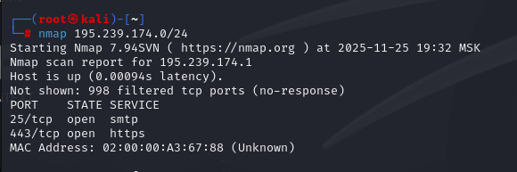{#fig:003 width=70%}

В наличии почтового сервера можно убедиться посмотрев веб-сраницу `https://195.239.174.1`. Перейдя по адресу увидим стандартный интерфейс для Microsoft Exchange Server (рис. [-@fig:004]).

{#fig:004 width=70%}

Определим версию программного обеспечения Exchange Server, чтобы найти уявзимости. Для этого используем URL-адрес для доступа к инструменту Microsoft Exchange eDiscovery Export Tool по ссылке: `https://195.239.174.1/ecp/Current/exporttool/microsoft.exchange.ediscovery.exporttool.application` (рис. [-@fig:005]).

{#fig:005 width=70%}

Скачаем файл в формате XML и откроем его в любом графическом редакторе. Просмотрим содержание документа и увидим строку `version="15.1.1713.5"` (рис. [-@fig:006]).

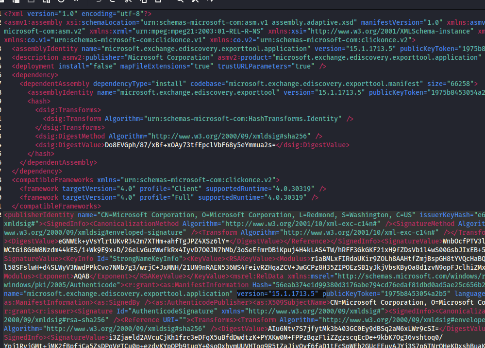{#fig:006 width=70%}

Перейдем в официальную документацию Microsoft Exchange и увидим, что сборка 15.1.1713.5 соответствует Exchange 2016 CU12, выпущенной 12 февраля 2019 года. Эта информация позволяет установить, что сервер не обновлялся с 2019 года и уязвим для более поздних эксплойтов (рис. [-@fig:007]).

{#fig:007 width=70%}

Для дальнейшего планирования вектора атаки используем веб-сайт `https://www.cvedetails.com`. Перейдем в раздел со школой "опасности" для различных уязвимостей. Изучим только самые опасные уязвимости, оценка которых больше или равна 9. Будем искать CVE с пометкой "public exploit exists", чтобы была возможность эксплуатации. Найдем уязвимсоть `CVE-2021-34473` и увидим, что первая дата раскрытия информации по уязвимости больше даты выпуска сборки атакуемого почтового сервера. Тогда, данную уязвимость можно эксплуатировать. 

Для атаки будем использовать инструмент для создания, тестирования и использования уязвимостей – Metasploit (рис. [-@fig:008]).

{#fig:008 width=70%}

Введем команду `search Exchange`, показывающую множество модулей, связанных с Exchange. В списке увидим ключевые модули для ProxyLogon и ProxyShell. Для получения сессии с удаленным хостом 195.239.174.1 будем использовать уязвимость ProxyLogon (рис. [-@fig:009]).

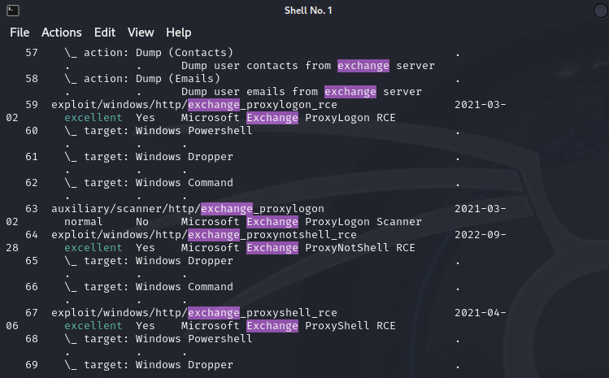{#fig:009 width=70%}

В нижней части страницы портала `portal.ampire.corp` можно найти информацию о легитимной почте одного из сотрудников. Будем использовать email `manager1@ampire.corp` в качестве параметра при эксплуатации уязвимости ProxyLogon для повышения шансов успеха (рис. [-@fig:010]). 

{#fig:010 width=70%}

В консоли Metasploit настроим параметры выбранного модуля: lhost (IP атакующего), rhosts (целевой сервер Exchange) и email (адрес пользователя manager1). Эти параметры необходимы для корректной работы эксплойта и получения обратного подключения (рис. [-@fig:011]).

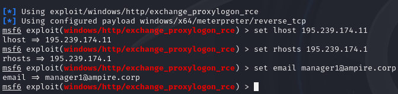{#fig:011 width=70%}

Далее запустим модуль. Успешная эксплуатация завершается открытием meterpreter-сессии на скомпрометированном почтовом сервере (рис. [-@fig:012]).

{#fig:012 width=70%}

## Оценка возможности проведения атаки.

После получения сессии с почтовым сервером Microsoft Exchange Server отобразим сетевые интерфейсы (рис. [-@fig:013]).

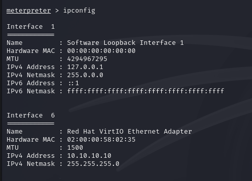{#fig:013 width=70%}

### Проброс портов.

Введем команду `run autoroute -s 10.10.10.0/24` в Metasploit. Эта команда добавляет маршрут ко внутренней подсети через скомпрометированный хост (Mail). Теперь трафик с машины атакующего может проксироваться через сессию meterpreter для доступа к внутренним ресурсам (рис. [-@fig:014]).

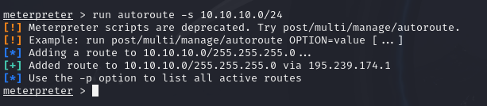{#fig:014 width=70%}

Продолжим сбор информации о подсети с помощью `arp_scanner`. Обнаружены активные хосты во внутренней подсети 10.10.10.0/24. Также выведен список IP-адресов и MAC-адресов, включая ключевые узлы, такие как 10.10.10.20 и 10.10.10.40. (рис. [-@fig:015]):

{#fig:015 width=70%}

### Сканирование компьютеров в домене.

Проведем сканирование всех компьютеров в домене с помощью модуля `enum_ad_computers` (рис. [-@fig:016]). В ходе сканирования обнаружен хост CS (Certificate Services), отвечающий за предоставление цифровых сертификатов.

{#fig:016 width=70%}

Выполним команду `nslookup cs.ampire.corp`. DNS-сервер возвращает IP-адрес центра сертификации — 10.10.10.40. Также виден IP-адрес самого контроллера домена — 10.10.10.20 (рис. [-@fig:017]):

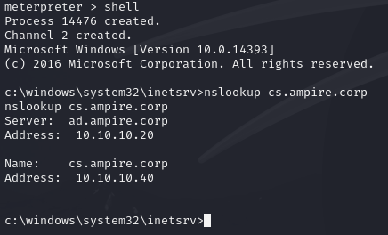{#fig:017 width=70%}

Отредактируем системный файл `/etc/hosts`. Добавим статические сопоставления доменных имён и IP-адресов: `ampire.corp`, `ad.ampire.corp`, `portal.ampire.corp` (рис. [-@fig:018]):

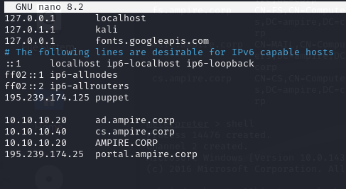{#fig:018 width=70%}

### Создание доменного пользователя.

Вернемся в shell-сессию с почтовым сервером и создадим доменного пользователя hack с паролем qwe123, который понадобится для сканирования домена на следующем этапе (рис. [-@fig:019]):

{#fig:019 width=70%}

### Запуск прокси-сервера и сканирование домена с использованием созданных учетных данных.

Выйдем из shell и свернем активную сессию. Затем в Metasploit выполним поиск и выберем модуль для развертывания SOCKS-прокси (рис. [-@fig:020]):

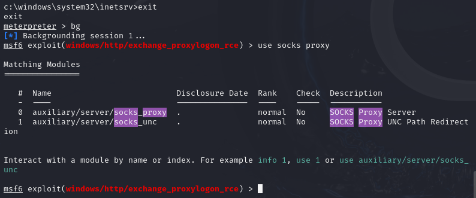{#fig:020 width=70%}

Перед запуском proxychains настроим и запустим прокси-сервер с помощью модуля socks_proxy. Проверим работоспособность прокси с помощью команды `jobs` (рис. [-@fig:021]):

{#fig:021 width=70%}

В новом терминале через proxychains запустим `certipy-ad find` с учетными данными пользователя hack. Инструмент сканирует службы AD CS на целевом контроллере домена. В результате обнаружены 33 шаблона сертификатов, 1 центр сертификации (CA) и сохранены данные для анализа в файлы (рис. [-@fig:022]):

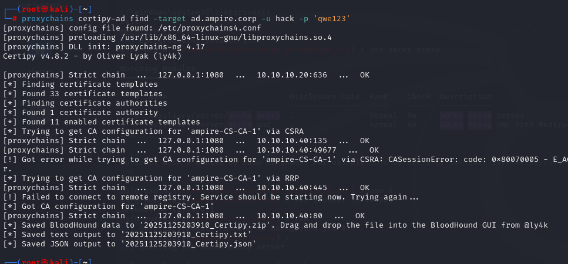{#fig:022 width=70%}

Посмотрим содержимое JSON-файла, сгенерированного certipy. В конфигурации центра сертификации увидим критическую уязвимость в Active Directory Certificate Services: "ESC8": "Web Enrollment is enabled and Request Disposition is set to Issue". Это прямое указание на наличие вектора для атаки (рис. [-@fig:023]):

{#fig:023 width=70%}

Таким образом, на этапе сканирования обнаружен вектор атаки ECS8. Уязвимость ESC8 позволяет:

- проводить NTLM Relay-атаки на сертификационный центр (CS);
- получать валидные сертификаты для учетных записей домена;
- эскалировать привилегии до уровня Domain Admin.

В данном случае можно:

1. Провести атаку NTLM-Relay на центр сертификации по Web Enrollment и получить сертификат хоста;
2. С помощью сертификата получить TGT-билет;
3. С помощью TGT-билета получить NTLM-хеш учетной записи хоста;
4. Использовать NTLM-хеш для авторизации на контроллере домена.

### Оценка возможности проведения атаки.

Проверим возможность проведения атаки с помощью инструментов PetitPotam и responder. Запустим утилиту `responder` с параметрами `-I eth0 -v`. Вывод показывает, что "отравители" (poisoners) протоколов LLMNR, NBT-NS, MDNS и DNS включены ON (рис. [-@fig:024] - [-@fig:025]):

{#fig:024 width=70%}

{#fig:025 width=70%}

Сообщение Listening for events… означает, что инструмент Responder:

- перешел в режим перехвата сетевых запросов;
- начал мониторинг протоколов: LLMNR, NBT-NS, MDNS и DHCP;

Далее с помощью утилиты PetitPotam (рис. [-@fig:026]) будем использовать принуждение к аутентификации, для этого в другом терминале kali перейдем в директорию PetitPotam. Таким образом, данный эксплойт принуждает сервер 10.10.10.20 аутентифицироваться на контроллере домена 195.239.174.11

{#fig:026 width=70%}

Как работает эксплойт:

- отправляет на целевой контроллер домена (10.10.10.20) запрос через протокол MS-EFSRPC, используя функцию EfsRpcOpenFileRaw;
- данный запрос принуждает сервер выполнить аутентификацию по протоколу NTLM или Kerberos на указанной машине (195.239.174.11);
- атакующая машина (195.239.174.11) должна ожидать входящих соединений и иметь инструмент для перехвата и ретрансляции (relay) указанных аутентификационных данных на другой сервер в сети (например, на сам контроллер домена) для выполнения команд.

Цель атаки:

- получить NTLM-хеши паролей или TGT-билеты Kerberos учетных записей с высокими привилегиями (например, учетной записи контроллера домена);
- выполнить произвольные команды на контроллере домена (если аутентификация ретранслируется обратно на него и уязвимость позволяет).

Особенности: для успешной атаки необходимо, чтобы на атакующей машине (195.239.174.11) был запущен сервер, ожидающий аутентификации (например, с помощью инструментов Impacket's ntlmrelayx или responder).

В окне, где работает responder, появились новые строки лога. Виден перехваченный NTLMv2 хеш для пользователя AD$ с домена AMPIRE. Это прямое доказательство, что принуждение к аутентификации через PetitPotam сработало, и хеш был успешно перехвачен (рис. [-@fig:027]):

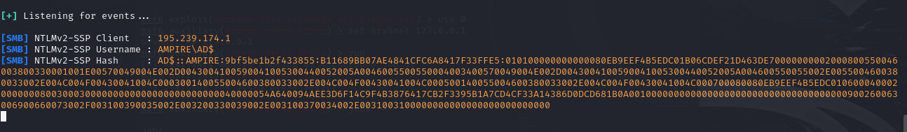{#fig:027 width=70%}

После получения запроса утилиту responder необходимо остановить в терминале сочетанием клавиш «Сtrl + C» (рис. [-@fig:028]):

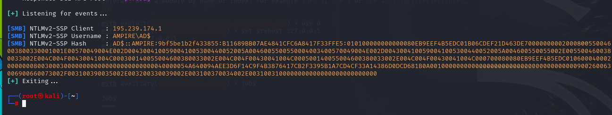{#fig:028 width=70%}

## Атака на центр сертификации (CS)

Атаку будем проводить поэтапно:

1. использование утилиты ntlmrelayx.py для получения сертификата в формате BASE64, который позволит выдать TGT (Ticket Granting Ticket) Kerberos (для инициации аутентификации используется PetitPotam);
2. использование утилиты gettgtpkinit.py для получения TGT-билета, используя полученный сертификат;
3. использование утилиты secretsdump.py для выгрузки хешей пользователей.

### Получение сертификата (ntlmrelayx)

Выполним атаку перехвата аутентификации NTLM на центр сертификации Active Directory Certificate Services (AD CS) с целью получения сертификата Kerberos. Запустим NTLM ретранслятор с помощью утилиты `ntlmrelayx` (рис. [-@fig:029]:

{#fig:029 width=70%}

Далее повторно запустим PetitPotam. После запуска утилиты в выводе будет написано название файла, в котором содержится сертификат (рис. [-@fig:030]):

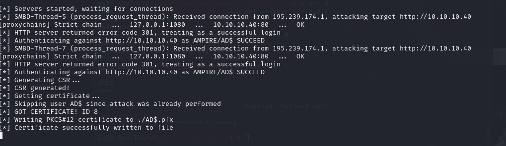{#fig:030 width=70%}

### Получение TGT-билета (gettgtpkinit)

С помощью утилиты `gettgtpkinit.py` и полученного файла AD$.pfx запрашиваем TGT-билет Kerberos у контроллера домена. В логах виден процесс: загрузка сертификата, запрос TGT на порт 88 контроллера и финальное сообщение Saved TGT to file. Билет сохраняется в файл ticket.ccache (рис. [-@fig:031]):

{#fig:031 width=70%}

Посмотрим содержимое директории, где находится только что созданный файл ticket.ccache. Это бинарный файл, содержащий Ticket-Granting Ticket Kerberos для учётной записи AD$. Наличие этого файла подтверждает успешный этап и позволяет перейти к аутентификации в домене по протоколу Kerberos. (рис. [-@fig:032]):

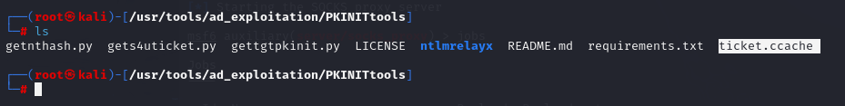{#fig:032 width=70%}

### Выгрузка хешей пользователей (secretsdump)

Полностью cдампить хеши паролей всех пользователей домена (включая администраторов) можно с использованием утилиты secretsdump. Данная утилита позволяет удаленно выгрузить хеши пользователей из файла ntds.dit и работает только при наличии действительного TGT (Ticket Granting Ticket) для доступа к домену. Для работы утилиты переменная окружения KRB5CCNAME должна указывать на файл с билетом. Добавим TGT-билет в переменные среды (рис. [-@fig:033]):

{#fig:033 width=70%}

Результат добавления можно просмотреть с помощью команды `printenv` (рис. [-@fig:034]):

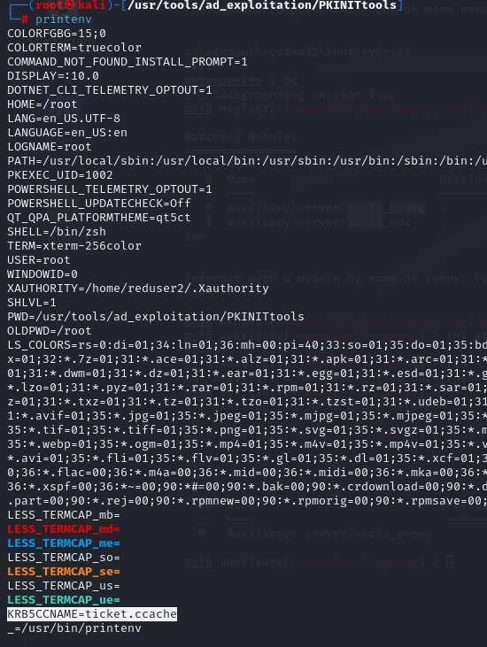{#fig:034 width=70%}

Запустим утилиту `impacket-secretsdump` с флагами `-k` и `-no-pass`. Инструмент подключается к контроллеру домена, используя TGT-билет, и начинает выгрузку хешей из базы NTDS.dit (рис. [-@fig:035]). В выводе видны хеши всех пользователей домена, включая строку с хешем Administrator — конечная цель этой фазы атаки.

{#fig:035 width=70%}

## Захват контроллера домена (AD)

Поскольку у нас имеется хеш доменного администратора, то для получения сессии с контроллером домена можно использовать:

1) модуль windows/smb/psexec;
2) или использовать файл smbexec.py.

### Получение сессии с помощью metasploit

Найдем и настроим модуль windows/smb/psexec (рис. [-@fig:036]). После запуска модуля открывается новая meterpreter-сессия, на этот раз уже непосредственно на контроллере домена, что означает его полную компрометацию.

{#fig:036 width=70%}

Перейдем в консоль, создадим пользователя hacker и добавим его в локальную группу Administrators (рис. [-@fig:037]). Команда `net user hacker` отображает результат, где в поле Comment виден флаг — доказательство выполнения задания.

{#fig:037 width=70%}

Скопируем полученный флаг и убедимся что задание успешно выполнилось (рис. [-@fig:038]).

{#fig:038 width=70%}

# Выводы

Начав с почтового сервера и закончив полным контролем над главным сервером управления, была взломана сеть компании. Успешное выполнение стало возможно из-за нескольких дыр в безопасности: устаревшего почтового сервера, неправильных настроек службы сертификатов и перехвата паролей между системами.
